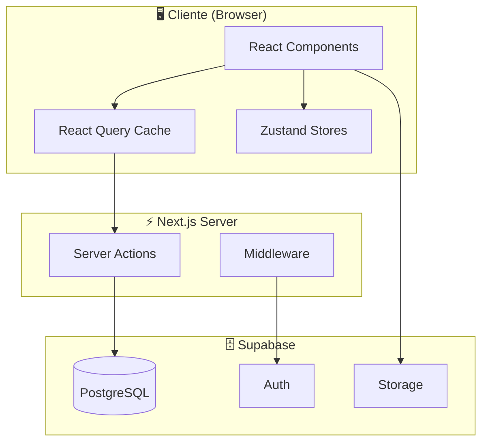
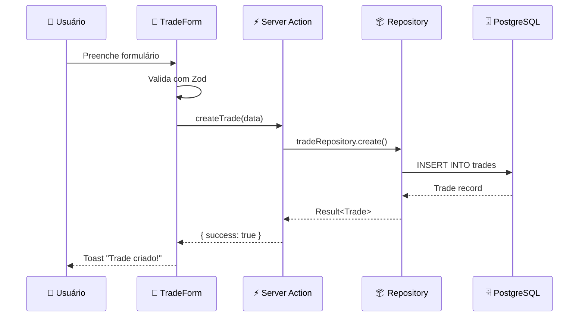

# 🏗️ Arquitetura - Visão Geral

> **Público:** Desenvolvedores | **Tempo:** ~10 min | **Atualizado:** 30 Dez 2025

---

## TL;DR

**Trading Journal Pro** usa arquitetura **Frontend-First com BaaS**:

- **Frontend:** Next.js 16 (App Router) + TypeScript + Tailwind
- **Backend:** Supabase (PostgreSQL + Auth + Storage)
- **ORM:** Prisma
- **State:** React Query (server) + Zustand (client)

---

## Diagrama de Alto Nível



---

## Stack Tecnológica

### Por que essas escolhas?

| Tecnologia   | Escolha             | Alternativa       | Justificativa                              |
| ------------ | ------------------- | ----------------- | ------------------------------------------ |
| Framework    | Next.js 16          | Remix, Vite       | Server Components, App Router, ecossistema |
| Banco        | Supabase (Postgres) | PlanetScale, Neon | Auth + Storage + Realtime integrados       |
| ORM          | Prisma              | Drizzle, Kysely   | Type-safety, migrations, DX                |
| Server State | React Query         | SWR, Apollo       | Cache, devtools, mutations                 |
| Client State | Zustand             | Redux, Jotai      | Simples, sem boilerplate                   |
| Styling      | Tailwind CSS        | CSS Modules       | Produtividade, consistência                |

---

## Estrutura de Pastas

```
src/
├── app/                    # 📄 Rotas (Next.js App Router)
│   ├── dashboard/          # Dashboard principal
│   ├── actions/            # Server Actions
│   └── api/                # API Routes
│
├── components/             # 🧩 Componentes React
│   ├── ui/                 # Design System (28 componentes)
│   ├── trades/             # Componentes de domínio
│   └── shared/             # Componentes compartilhados
│
├── features/               # 🎯 Módulos por domínio (NOVO)
│   ├── mental/             # Módulo de emoções
│   ├── dashboard/          # Re-exports de hooks
│   ├── trades/             # Hooks + constants de trades
│   └── ...                 # 8 features no total
│
├── hooks/                  # 🪝 Custom Hooks (15)
├── lib/                    # 🔧 Utilitários
│   ├── database/           # Prisma + Repositories
│   ├── errors/             # Error handling
│   └── security/           # Sanitização, validação
│
├── store/                  # 🗃️ Zustand Stores (6)
└── types/                  # 📐 TypeScript Types
```

---

## Fluxo de Dados

### Camadas (de cima para baixo)

```
┌─────────────────────────────────────────┐
│  CAMADA 1: PÁGINAS (App Router)         │  ← Orquestração
└─────────────────────────────────────────┘
              ↓ (usa)
┌─────────────────────────────────────────┐
│  CAMADA 2: COMPONENTES                  │  ← UI & Interação
└─────────────────────────────────────────┘
              ↓ (usa)
┌─────────────────────────────────────────┐
│  CAMADA 3: HOOKS + SERVER ACTIONS       │  ← Estado & Lógica
└─────────────────────────────────────────┘
              ↓ (usa)
┌─────────────────────────────────────────┐
│  CAMADA 4: REPOSITORIES (Prisma)        │  ← Acesso a Dados
└─────────────────────────────────────────┘
              ↓ (usa)
┌─────────────────────────────────────────┐
│  CAMADA 5: SUPABASE                     │  ← Infraestrutura
└─────────────────────────────────────────┘
```

> **Regra:** Cada camada só pode importar da camada imediatamente abaixo.

---

## Exemplo: Criar um Trade



---

## Segurança

### RLS (Row Level Security)

Cada usuário só vê seus próprios dados. Implementado no PostgreSQL:

```sql
CREATE POLICY "Users see own trades"
ON trades FOR SELECT
USING (auth.uid() = user_id);
```

**Analogia:** Como um prédio de apartamentos onde cada morador tem uma chave que só abre seu apartamento.

### Autenticação

- **Provider:** Supabase Auth (JWT em cookies httpOnly)
- **Sessão:** 7 dias, refresh automático
- **RBAC:** 4 papéis (user, mentor, admin, super_admin)

---

## Métricas Atuais

| Métrica          | Valor   |
| ---------------- | ------- |
| Linhas de código | ~55.000 |
| Arquivos TS/TSX  | ~300    |
| Componentes UI   | 28      |
| Custom Hooks     | 15      |
| Testes passando  | 1120+   |
| Coverage         | ~72%    |

---

## Próximos Passos

- [Camada de Dados](./data-layer.md) - Database e Prisma
- [Autenticação](./auth-flow.md) - Login e RBAC
- [ADRs](./decisions/) - Decisões arquiteturais

---

**Referências:**

- [Next.js App Router](https://nextjs.org/docs/app)
- [Supabase Docs](https://supabase.com/docs)
- [Prisma Docs](https://www.prisma.io/docs)
