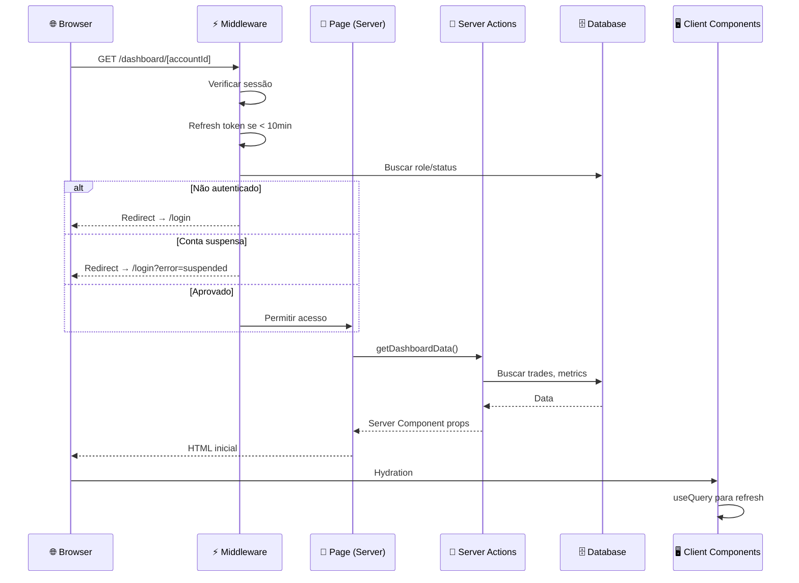

# 📊 Dashboard - Fluxo de Inicialização

> **Público:** Desenvolvedores | **Tempo:** ~8 min | **Atualizado:** 30 Dez 2025

---

## O que é? (Para leigos)

Quando você abre o dashboard, muita coisa acontece nos bastidores: o sistema verifica se você está logado, carrega suas contas de trading, busca seus trades e métricas. Este documento explica esse fluxo passo a passo.

---

## Como funciona? (Técnico)

### Diagrama de Sequência



---

## Os 3 Pontos Críticos

### 1. Middleware (`src/middleware.ts`)

```typescript
// Verifica sessão e faz refresh se necessário
const {
  data: { session },
} = await supabase.auth.getSession();

if (session?.expires_at) {
  const expiresIn = session.expires_at * 1000 - Date.now();
  // Refresh se faltam menos de 10 minutos
  if (expiresIn < 10 * 60 * 1000 && expiresIn > 0) {
    await supabase.auth.refreshSession();
  }
}

// Consulta status e papel do usuário
const user = await checkUserStatus(supabase, session.user.id);

// Decide redirecionamento
const redirect = resolveRedirect(pathname, user);
if (redirect) return NextResponse.redirect(redirect);
```

### 2. Server Action (`src/app/actions/dashboard.ts`)

```typescript
export async function getDashboardData(accountId: string) {
  // Pega usuário atual
  const userId = await getCurrentUserId();
  if (!userId) throw new Error("Not authenticated");

  // Busca dados em paralelo
  const [trades, metrics, account] = await Promise.all([
    tradeRepository.getByAccount(accountId),
    analyticsService.calculateMetrics(accountId),
    accountRepository.getById(accountId),
  ]);

  return { trades, metrics, account };
}
```

### 3. Client Hook (`src/hooks/useDashboardData.ts`)

```typescript
export function useDashboardData(accountId: string) {
  return useQuery({
    queryKey: ["dashboard", accountId],
    queryFn: () => getDashboardDataAction(accountId),
    staleTime: 5 * 60 * 1000, // 5 minutos
    refetchOnWindowFocus: true,
  });
}
```

---

## Troubleshooting

### ❌ "Por que redireciona para `/`?"

**Causas possíveis:**

| Sintoma            | Causa                     | Solução                       |
| ------------------ | ------------------------- | ----------------------------- |
| Sempre redireciona | Sessão expirada           | Verificar cookies no DevTools |
| Intermitente       | Race condition no refresh | Ver logs do middleware        |
| Após idle          | Token não foi refreshed   | Aumentar margem de refresh    |

**Debug:**

```typescript
// Adicione log no middleware
console.log("[MW]", {
  path: pathname,
  hasSession: !!session,
  expiresIn: session?.expires_at ? (session.expires_at * 1000 - Date.now()) / 1000 : null,
  userStatus: user?.status,
});
```

### ❌ "Por que está lento?"

**Métricas esperadas:**

| Etapa                 | Tempo esperado |
| --------------------- | -------------- |
| Middleware            | < 100ms        |
| Server Action         | < 500ms        |
| Primeira renderização | < 1s           |
| Hydration             | < 500ms        |

**Causas comuns:**

1. Query N+1 no repository
2. Sem índice no banco
3. Muitos dados sendo carregados

**Solução:** Use `EXPLAIN ANALYZE` nas queries lentas.

### ❌ "Dashboard vazio mesmo com trades"

1. Verifique `accountId` na URL
2. Verifique se trades têm `account_id` correto
3. Verifique RLS policies

---

## Quando usar / Quando evitar

✅ **Use este fluxo quando:**

- Precisa de dados no primeiro render (SEO)
- Dados são sensíveis (precisa de auth no servidor)
- Quer cache compartilhado entre usuários

❌ **Evite quando:**

- Dados mudam muito rápido (use polling)
- Dados são grandes (pagine no cliente)
- UX precisa de loading skeleton (prefetch)

---

## Arquivos Relacionados

- `src/middleware.ts` - Orquestrador de auth
- `src/app/dashboard/[accountId]/page.tsx` - Página
- `src/app/actions/dashboard.ts` - Server Actions
- `src/hooks/useDashboardData.ts` - Client hook
- `src/hooks/useDashboardInit.ts` - Inicialização

---

## Próximos Passos

- [Autenticação](../02-architecture/auth-flow.md) - Detalhes do middleware
- [Trades CRUD](./trades/crud-flow.md) - Operações de trade
