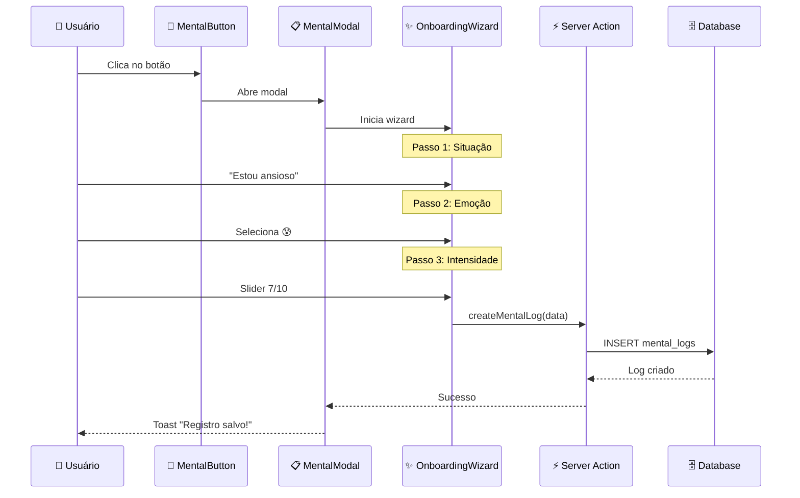

# 🧠 Módulo de Emoções - Visão Geral

> **Público:** Todos | **Tempo:** ~6 min | **Atualizado:** 30 Dez 2025

---

## O que é? (Para leigos)

O módulo de emoções ajuda traders a registrar seu estado mental antes e depois de operar. Funciona como um "diário psicológico de trading" que ajuda a identificar padrões emocionais que afetam a performance.

**Exemplos de uso:**

- "Estou ansioso antes de uma notícia importante"
- "Me sinto confiante após 3 wins seguidos"
- "Frustrado depois de um stop loss"

---

## Como funciona? (Técnico)

### Arquitetura do Módulo

```
src/features/mental/
├── components/
│   ├── MentalButton.tsx        # Botão que abre o modal
│   ├── MentalModal.tsx         # Modal principal
│   ├── OnboardingWizard.tsx    # Wizard de 3 passos
│   ├── EmotionalProfileView.tsx # Visualização do perfil
│   ├── PerformanceGauge.tsx    # Gauge de performance
│   └── history/                # Componentes de histórico
├── hooks/
│   └── useMentalHub.ts         # Hook principal
├── constants/
│   └── mental.ts               # Configurações e opções
└── index.ts                    # Barrel export
```

---

## Fluxo de Dados



---

## Modelo de Dados

### Tabela `mental_logs`

| Coluna       | Tipo      | Descrição          |
| ------------ | --------- | ------------------ |
| `id`         | UUID      | PK                 |
| `user_id`    | UUID      | FK → auth.users    |
| `account_id` | UUID      | FK → accounts      |
| `situation`  | TEXT      | Situação descrita  |
| `emotion`    | TEXT      | Emoção selecionada |
| `intensity`  | INT       | 1-10               |
| `created_at` | TIMESTAMP | Data/hora          |

### Tabela `emotional_profile`

| Coluna            | Tipo  | Descrição     |
| ----------------- | ----- | ------------- |
| `id`              | UUID  | PK            |
| `user_id`         | UUID  | FK            |
| `strengths`       | JSONB | Pontos fortes |
| `weaknesses`      | JSONB | Pontos fracos |
| `recommendations` | JSONB | Sugestões     |

---

## Exemplo de Código

### Usando o hook principal

```typescript
import { useMentalHub } from "@/features/mental";

function Dashboard() {
  const {
    logs,           // Histórico de logs
    profile,        // Perfil emocional
    createLog,      // Criar novo log
    isLoading
  } = useMentalHub(accountId);

  const handleSave = async (data) => {
    await createLog({
      situation: data.situation,
      emotion: data.emotion,
      intensity: data.intensity,
    });
  };

  return (
    <MentalButton onClick={openModal} />
  );
}
```

### Importando do módulo

```typescript
// ✅ Correto: importar da feature
import { MentalButton, useMentalHub } from "@/features/mental";

// ❌ Evitar: importar diretamente
import { MentalButton } from "@/components/mental/MentalButton";
```

---

## Troubleshooting

### ❌ "Histórico vazio"

**Causa:** Bug anterior onde logs eram salvos com `account_id` incorreto.

**Solução:** Verificar se `account_id` está sendo passado corretamente:

```typescript
// Verificar no hook
console.log("Creating log with:", { accountId, userId });
```

### ❌ "Perfil não carrega"

1. Verificar se usuário completou onboarding
2. Verificar se `emotional_profile` existe para o user
3. Verificar RLS policies

---

## Quando usar / Quando evitar

✅ **Use quando:**

- Trader quer registrar estado mental
- Antes de sessões de trading
- Análise de performance psicológica

❌ **Evite quando:**

- Precisa de análise em tempo real (use polling separado)
- Dados históricos extensos (pagine)

---

## Próximos Passos

- [Dashboard Flow](../dashboard/initialization-flow.md)
- [Contribuindo](../../04-development/contributing.md)
