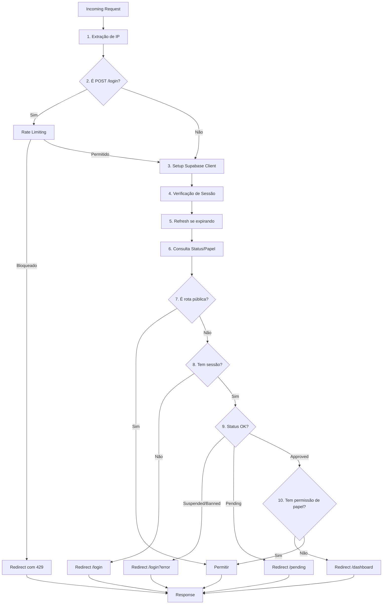

# Arquitetura de Segurança

## Índice

1. [Visão Geral](#overview)
2. [Autenticação e Autorização](#auth)
3. [Segurança do Middleware](#middleware)
4. [Rate Limiting](#rate-limiting)
5. [Headers de Segurança](#headers)
6. [Validação de Entrada](#validation)
7. [Logs de Auditoria](#audit)
8. [Monitoramento e Troubleshooting](#monitoring)
9. [Modelo de Ameaças](#threat-model)
10. [Checklist de Segurança](#checklist)
11. [Referências](#references)

---

## Visão Geral {#overview}

Este documento descreve a arquitetura de segurança do Journal-NextJs, incluindo autenticação, autorização, proteção de rotas, rate limiting, e defesas contra ameaças comuns (OWASP Top 10).

### Stack de Segurança

| Componente               | Tecnologia                     | Propósito                            |
| ------------------------ | ------------------------------ | ------------------------------------ |
| **Autenticação**         | Supabase Auth                  | Gerenciamento de sessão e identidade |
| **Autorização**          | RBAC Customizado               | Controle de acesso baseado em papéis |
| **Rate Limiting**        | Upstash Redis                  | Proteção contra força bruta          |
| **Headers de Segurança** | Next.js Config                 | CSP, HSTS, X-Frame-Options           |
| **Validação**            | Prisma ORM + Custom Validators | Prevenção de SQL injection e XSS     |
| **Logs**                 | Supabase + Prisma              | Auditoria e rastreamento             |

### Princípios de Design

- **Defesa em Profundidade**: Múltiplas camadas de segurança
- **Fail Secure**: Falhas levam à negação de acesso, não permissão
- **Privilégio Mínimo**: Usuários têm apenas as permissões necessárias
- **Auditoria Completa**: Todas as ações sensíveis são logadas

---

## Autenticação e Autorização {#auth}

### Gerenciamento de Sessão

**Provedor**: Supabase Auth com cookies httpOnly

**Características**:

- **Tokens**: JWT armazenados em cookies httpOnly para prevenir XSS
- **Refresh Automático**: Sessões são renovadas automaticamente quando expiram em <10 minutos
- **Duração**: 7 dias (configurável via Supabase Dashboard)
- **Revogação**: Logout invalida tokens no servidor

**Implementação** ([middleware.ts:71-82](file:///home/jhontavares/Documents/Programacao/Journal-NextJs/src/middleware.ts#L71-L82)):

```typescript
// Refresh session if expiring in < 10 mins
const {
  data: { session },
} = await supabase.auth.getSession();

if (session?.expires_at) {
  const expiresIn = session.expires_at * 1000 - Date.now();
  if (expiresIn < 10 * 60 * 1000 && expiresIn > 0) {
    await supabase.auth.refreshSession();
  }
}
```

### Controle de Acesso Baseado em Papel (RBAC)

**Papéis Disponíveis**:

| Papel         | Nível | Descrição                                           |
| ------------- | ----- | --------------------------------------------------- |
| `user`        | 1     | Usuário padrão com acesso a funcionalidades básicas |
| `mentor`      | 2     | Usuário + funcionalidades de mentoria               |
| `admin`       | 3     | Acesso administrativo completo                      |
| `super_admin` | 4     | Admin + acesso a logs de auditoria                  |

**Matriz de Permissões** ([route-config.ts](file:///home/jhontavares/Documents/Programacao/Journal-NextJs/src/config/route-config.ts)):

| Rota/Recurso        | user | mentor | admin | super_admin |
| ------------------- | ---- | ------ | ----- | ----------- |
| `/dashboard`        | ✅   | ✅     | ✅    | ✅          |
| `/trades`           | ✅   | ✅     | ✅    | ✅          |
| `/journal`          | ✅   | ✅     | ✅    | ✅          |
| `/playbook`         | ✅   | ✅     | ✅    | ✅          |
| `/mentor/dashboard` | ❌   | ✅     | ✅    | ❌          |
| `/admin`            | ❌   | ❌     | ✅    | ✅          |
| `/admin/mentores`   | ❌   | ❌     | ✅    | ✅          |
| `/admin/audit-logs` | ❌   | ❌     | ❌    | ✅          |

### Status de Usuário

Além do papel, usuários têm um `status` que afeta o acesso:

| Status      | Comportamento                                        |
| ----------- | ---------------------------------------------------- |
| `pending`   | Redirecionado para `/pending` (aguardando aprovação) |
| `approved`  | Acesso normal conforme papel                         |
| `suspended` | Redirecionado para `/login?error=account_suspended`  |
| `banned`    | Redirecionado para `/login?error=account_suspended`  |

**Implementação** ([middleware-utils.ts:96-109](file:///home/jhontavares/Documents/Programacao/Journal-NextJs/src/lib/auth/middleware-utils.ts#L96-L109)):

```typescript
// Suspended/Banned users
if (user.status === "suspended" || user.status === "banned") {
  if (path.startsWith("/login")) return null;
  return "/login?error=account_suspended";
}

// Pending users
if (user.status === "pending") {
  if (path === "/pending") return null;
  if (isPublicRoute(path) && path !== "/login") return null;
  return "/pending";
}
```

---

## Segurança do Middleware {#middleware}

### Arquitetura Geral

O middleware é o ponto de entrada para **todas** as requisições e executa verificações de segurança em múltiplas camadas.

**Fluxo de Processamento**:



### Estrutura de Arquivos

```
src/
├── middleware.ts                    # Orquestrador principal
├── config/
│   └── route-config.ts              # Definição de rotas e permissões
└── lib/
    ├── auth/
    │   └── middleware-utils.ts      # Funções auxiliares
    └── ratelimit.ts                 # Cliente Redis e rate limiting
```

### Implementação Detalhada

#### 1. Detecção de IP ([middleware-utils.ts:21-33](file:///home/jhontavares/Documents/Programacao/Journal-NextJs/src/lib/auth/middleware-utils.ts#L21-L33))

O IP do cliente é extraído com fallbacks robustos para diferentes proxies:

```typescript
export function getClientIP(req: NextRequest): string | null {
  // Prioridade: Cloudflare → X-Forwarded-For → X-Real-IP → True-Client-IP
  const headers = ["cf-connecting-ip", "x-forwarded-for", "x-real-ip", "true-client-ip"];

  for (const header of headers) {
    const value = req.headers.get(header);
    if (value) {
      // X-Forwarded-For pode conter múltiplos IPs separados por vírgula
      return value.split(",")[0].trim();
    }
  }

  return null;
}
```

**Nota**: Em produção no Vercel/Cloudflare, `cf-connecting-ip` é preferido por ser mais confiável.

#### 2. Rate Limiting (apenas `/login`)

Rate limiting é aplicado **apenas para tentativas de login** para prevenir força bruta. Veja seção [Rate Limiting](#rate-limiting) para detalhes.

#### 3. Setup do Cliente Supabase ([middleware.ts:45-69](file:///home/jhontavares/Documents/Programacao/Journal-NextJs/src/middleware.ts#L45-L69))

O cliente Supabase SSR é configurado com gerenciamento de cookies:

```typescript
const supabase = createServerClient(
  process.env.NEXT_PUBLIC_SUPABASE_URL!,
  process.env.NEXT_PUBLIC_SUPABASE_ANON_KEY!,
  {
    cookies: {
      get(name: string) {
        return req.cookies.get(name)?.value;
      },
      set(name: string, value: string, options: CookieOptions) {
        // Atualiza tanto request quanto response
        req.cookies.set({ name, value, ...options });
        response.cookies.set({ name, value, ...options });
      },
      remove(name: string, options: CookieOptions) {
        req.cookies.set({ name, value: "", ...options });
        response.cookies.set({ name, value: "", ...options });
      },
    },
  }
);
```

#### 4. Verificação e Refresh de Sessão

A sessão é verificada e automaticamente renovada se estiver próxima da expiração (< 10 minutos).

#### 5. Consulta de Status e Papel ([middleware-utils.ts:66-83](file:///home/jhontavares/Documents/Programacao/Journal-NextJs/src/lib/auth/middleware-utils.ts#L66-L83))

```typescript
export async function checkUserStatus(
  supabase: SupabaseClient,
  userId: string
): Promise<UserContext | null> {
  const { data: profile } = await supabase
    .from("users_extended")
    .select("role, status")
    .eq("id", userId)
    .maybeSingle();

  if (!profile) return null;

  return {
    id: userId,
    role: profile.role || "user",
    status: profile.status || "pending",
  };
}
```

**Performance**: Esta consulta é feita em **toda requisição autenticada**. Para otimização futura, considere adicionar cache em memória com TTL curto (30-60s).

#### 6. Resolução de Redirecionamento ([middleware-utils.ts:89-123](file:///home/jhontavares/Documents/Programacao/Journal-NextJs/src/lib/auth/middleware-utils.ts#L89-L123))

Lógica centralizada que decide se o usuário deve ser redirecionado:

```typescript
export function resolveRedirect(path: string, user: UserContext | null): string | null {
  // 1. Usuários não autenticados
  if (!user) {
    if (isPublicRoute(path)) return null;
    return "/login";
  }

  // 2. Usuários suspensos/banidos
  if (user.status === "suspended" || user.status === "banned") {
    if (path.startsWith("/login")) return null;
    return "/login?error=account_suspended";
  }

  // 3. Usuários pendentes
  if (user.status === "pending") {
    if (path === "/pending") return null;
    if (isPublicRoute(path) && path !== "/login") return null;
    return "/pending";
  }

  // 4. Usuários aprovados não devem ver /pending
  if (user.status === "approved" && path === "/pending") {
    return "/";
  }

  // 5. Controle de acesso baseado em papel
  if (!hasRouteAccess(path, user.role)) {
    return "/dashboard";
  }

  return null; // Acesso permitido
}
```

### Rotas Públicas vs Protegidas

#### Rotas Públicas (Sem Autenticação)

Definidas em [route-config.ts:14-27](file:///home/jhontavares/Documents/Programacao/Journal-NextJs/src/config/route-config.ts#L14-L27):

```typescript
export const PUBLIC_PATTERNS = [
  /^\/login$/,
  /^\/auth\/.*$/, // /auth/callback, /auth/reset-password
  /^\/share$/,
  /^\/share\/.*$/, // Visualização pública de playbooks
  /^\/pending$/,
  /^\/termos$/,
  /^\/privacidade$/,
  /^\/comunidade$/,
  /^\/api\/public\/.*$/,
  /^\/_next\/.*$/, // Assets estáticos
  /^\/favicon\.ico$/,
  /^\/.*\.(svg|png|jpg|jpeg|gif|webp)$/, // Imagens
];
```

#### Rotas Protegidas (Autenticação + Papel)

```typescript
export const ROUTE_PERMISSIONS: Record<string, UserRole[]> = {
  "/admin": ["admin", "super_admin"],
  "/admin/mentores": ["admin", "super_admin"],
  "/admin/audit-logs": ["super_admin"],
  "/mentor/dashboard": ["mentor", "admin"],
  "/dashboard": ["user", "mentor", "admin", "super_admin"],
  "/trades": ["user", "mentor", "admin", "super_admin"],
  "/journal": ["user", "mentor", "admin", "super_admin"],
  "/playbook": ["user", "mentor", "admin", "super_admin"],
};
```

**Estratégia de Matching**:

- Primeiro tenta match exato (`/admin`)
- Se não encontrar, busca o **prefixo mais longo** que combina (`/admin/usuarios` → `/admin`)
- Se nada combinar e a rota não é pública, assume papel `user` como padrão

#### Exceções no Matcher

O middleware **não é executado** para:

- `/_next/static/*` (arquivos estáticos do Next.js)
- `/_next/image/*` (otimização de imagens)
- `/favicon.ico`
- Arquivos com extensão de imagem (svg, png, jpg, jpeg, gif, webp)

Configurado em [middleware.ts:117-128](file:///home/jhontavares/Documents/Programacao/Journal-NextJs/src/middleware.ts#L117-L128):

```typescript
export const config = {
  matcher: ["/((?!_next/static|_next/image|favicon.ico|.*\\.(?:svg|png|jpg|jpeg|gif|webp)$).*)"],
};
```

### Logging de Acesso

Eventos de acesso são logados para auditoria ([middleware-utils.ts:128-153](file:///home/jhontavares/Documents/Programacao/Journal-NextJs/src/lib/auth/middleware-utils.ts#L128-L153)):

```typescript
logAccessEvent({
  path: pathname,
  method: req.method,
  ip,
  userId: session?.user?.id,
  role: userContext?.role,
  action: "redirected",
  reason: "access_policy",
  redirectTo: redirectPath,
});
```

**Formato de Log (Produção)**:

```json
{
  "timestamp": "2025-12-24T14:00:00.000Z",
  "level": "info",
  "type": "access_control",
  "path": "/admin",
  "method": "GET",
  "ip": "192.168.1.1",
  "userId": "uuid",
  "role": "user",
  "action": "redirected",
  "reason": "access_policy",
  "redirectTo": "/dashboard"
}
```

---

## Rate Limiting {#rate-limiting}

### Visão Geral

Rate limiting protege contra ataques de força bruta, especialmente em endpoints de autenticação. Implementado com **Upstash Redis** e algoritmo de **Sliding Window**.

### Configuração Atual

**Provedor**: Upstash Redis (serverless)  
**Algoritmo**: Sliding Window Counter (mais preciso que Fixed Window)  
**Escopo**: Apenas rota `/login` (POST)

**Limites** ([ratelimit.ts:21-27](file:///home/jhontavares/Documents/Programacao/Journal-NextJs/src/lib/ratelimit.ts#L21-L27)):

```typescript
export const loginRateLimit = redis
  ? new Ratelimit({
      redis,
      limiter: Ratelimit.slidingWindow(5, "15 m"),
      analytics: true,
      prefix: "journal:login",
    })
  : null;
```

| Endpoint      | Janela     | Máx. Requisições | Identificador |
| ------------- | ---------- | ---------------- | ------------- |
| `POST /login` | 15 minutos | 5                | IP do cliente |

**Por que Sliding Window?**

- Mais preciso que Fixed Window
- Previne "boundary attacks" (enviar 5 req às 00:59 e 5 às 01:00)
- Distribui a carga uniformemente

### Implementação Detalhada

#### Cliente Redis ([ratelimit.ts:12-15](file:///home/jhontavares/Documents/Programacao/Journal-NextJs/src/lib/ratelimit.ts#L12-L15))

```typescript
const redis =
  process.env.UPSTASH_REDIS_REST_URL && process.env.UPSTASH_REDIS_REST_TOKEN
    ? Redis.fromEnv()
    : null;
```

**Variáveis de Ambiente Necessárias**:

- `UPSTASH_REDIS_REST_URL`
- `UPSTASH_REDIS_REST_TOKEN`

**Comportamento em Desenvolvimento**: Se Redis não estiver configurado, rate limiting é **desabilitado** com warning no console.

#### Verificação de Rate Limit ([ratelimit.ts:45-67](file:///home/jhontavares/Documents/Programacao/Journal-NextJs/src/lib/ratelimit.ts#L45-L67))

```typescript
export async function checkLoginRateLimit(identifier: string): Promise<RateLimitResult> {
  // Modo desenvolvimento sem Redis - permitir todas
  if (!loginRateLimit) {
    if (process.env.NODE_ENV === "development") {
      console.warn("⚠️ Rate limiting disabled: Upstash Redis not configured");
    }
    return {
      success: true,
      limit: 5,
      remaining: 5,
      reset: Date.now() + 15 * 60 * 1000,
    };
  }

  const result = await loginRateLimit.limit(identifier);

  return {
    success: result.success,
    limit: result.limit,
    remaining: result.remaining,
    reset: result.reset,
  };
}
```

#### Headers de Resposta ([ratelimit.ts:74-87](file:///home/jhontavares/Documents/Programacao/Journal-NextJs/src/lib/ratelimit.ts#L74-L87))

Quando rate limit é atingido, os seguintes headers são retornados:

```typescript
X-RateLimit-Limit: 5
X-RateLimit-Remaining: 0
X-RateLimit-Reset: 2025-12-24T14:15:00.000Z
Retry-After: 900  // segundos
```

**Implementação**:

```typescript
export function buildRateLimitHeaders(result: RateLimitResult): HeadersInit {
  const headers: HeadersInit = {
    "X-RateLimit-Limit": result.limit.toString(),
    "X-RateLimit-Remaining": result.remaining.toString(),
    "X-RateLimit-Reset": new Date(result.reset).toISOString(),
  };

  if (!result.success) {
    const retryAfterSeconds = Math.ceil((result.reset - Date.now()) / 1000);
    headers["Retry-After"] = Math.max(0, retryAfterSeconds).toString();
  }

  return headers;
}
```

#### Integração no Middleware ([middleware.ts:20-36](file:///home/jhontavares/Documents/Programacao/Journal-NextJs/src/middleware.ts#L20-L36))

```typescript
if (pathname === "/login" && req.method === "POST") {
  const rateLimit = await handleLoginRateLimit(req, ip);
  if (!rateLimit.success && rateLimit.redirectUrl) {
    logAccessEvent({
      path: pathname,
      method: req.method,
      ip,
      action: "blocked",
      reason: "rate_limit_exceeded",
      redirectTo: rateLimit.redirectUrl.toString(),
    });
    return NextResponse.redirect(rateLimit.redirectUrl, {
      headers: rateLimit.headers,
    });
  }
}
```

### Estratégia de Identificação

**Identificador**: IP do cliente  
**Fonte**: Headers `cf-connecting-ip`, `x-forwarded-for`, `x-real-ip`, `true-client-ip` (nesta ordem)

**Comportamento em Caso de IP Desconhecido**: Fail-open (permite a requisição e loga warning)

### Expansão Futura

Para adicionar rate limiting a outros endpoints:

```typescript
// Exemplo: Rate limiting para API de trades
export const tradesRateLimit = redis
  ? new Ratelimit({
      redis,
      limiter: Ratelimit.slidingWindow(100, "1 m"),
      analytics: true,
      prefix: "journal:trades",
    })
  : null;
```

Adicionar verificação no middleware:

```typescript
if (pathname.startsWith("/api/trades")) {
  const rateLimit = await checkTradesRateLimit(ip);
  // ...
}
```

---

## Headers de Segurança {#headers}

### Visão Geral

Headers de segurança são configurados globalmente em [next.config.mjs:19-66](file:///home/jhontavares/Documents/Programacao/Journal-NextJs/next.config.mjs#L19-L66) e aplicados a **todas** as respostas.

### Headers Implementados

| Header                      | Valor                                                          | Propósito                   | Prioridade |
| --------------------------- | -------------------------------------------------------------- | --------------------------- | ---------- |
| `X-Frame-Options`           | `DENY`                                                         | Previne clickjacking        | Alta       |
| `X-Content-Type-Options`    | `nosniff`                                                      | Previne MIME sniffing       | Alta       |
| `Strict-Transport-Security` | `max-age=31536000; includeSubDomains; preload`                 | Força HTTPS                 | Crítica    |
| `Content-Security-Policy`   | [Ver CSP](#csp-details)                                        | Controla origem de recursos | Crítica    |
| `X-XSS-Protection`          | `1; mode=block`                                                | XSS protection (legado)     | Média      |
| `Referrer-Policy`           | `strict-origin-when-cross-origin`                              | Controla referrer           | Média      |
| `Permissions-Policy`        | `camera=(), microphone=(), geolocation=(), interest-cohort=()` | Desabilita APIs             | Baixa      |

### Detalhamento dos Headers

#### 1. X-Frame-Options: DENY

**O que previne**: Clickjacking (embedding da página em iframes maliciosos)

**Alternativa Moderna**: O header CSP `frame-ancestors 'none'` fornece a mesma proteção. Ambos são configurados para compatibilidade com browsers antigos.

```javascript
{ key: "X-Frame-Options", value: "DENY" }
```

#### 2. X-Content-Type-Options: nosniff

**O que previne**: MIME type sniffing attacks, onde o browser tenta "adivinhar" o tipo de conteúdo e executar scripts disfarçados de imagem.

```javascript
{ key: "X-Content-Type-Options", value: "nosniff" }
```

#### 3. X-XSS-Protection: 1; mode=block

**Status**: **Deprecated** na maioria dos browsers modernos, mas mantido para compatibilidade.

**Comportamento**: Ativa filtro XSS do browser (Edge, Safari antigo) e bloqueia a página se detectar XSS.

**Nota**: Proteção real contra XSS vem do CSP e escaping do React.

```javascript
{ key: "X-XSS-Protection", value: "1; mode=block" }
```

#### 4. Referrer-Policy: strict-origin-when-cross-origin

**Comportamento**:

- Mesma origem → envia URL completo
- Cross-origin (HTTPS → HTTPS) → envia apenas origem (https://example.com)
- Cross-origin (HTTPS → HTTP) → não envia nada

**Por que não `no-referrer`?** Analytics e logs precisam de informação de origem para debugging.

```javascript
{ key: "Referrer-Policy", value: "strict-origin-when-cross-origin" }
```

#### 5. Permissions-Policy

**APIs Desabilitadas**:

- `camera=()` - Acesso à câmera
- `microphone=()` - Acesso ao microfone
- `geolocation=()` - Geolocalização
- `interest-cohort=()` - FLoC (rastreamento Google)

**Por que desabilitar?** A aplicação não precisa dessas APIs, então desabilitamos por princípio de privilégio mínimo.

```javascript
{
  key: "Permissions-Policy",
  value: "camera=(), microphone=(), geolocation=(), interest-cohort=()"
}
```

### Strict-Transport-Security (HSTS) {#hsts}

**Header Completo**:

```
Strict-Transport-Security: max-age=31536000; includeSubDomains; preload
```

**Componentes**:

| Diretiva            | Valor      | Significado                                          |
| ------------------- | ---------- | ---------------------------------------------------- |
| `max-age`           | `31536000` | 365 dias (1 ano)                                     |
| `includeSubDomains` | -          | Aplica a todos os subdomínios                        |
| `preload`           | -          | Solicita inclusão na lista HSTS preload dos browsers |

**O que faz**:

1. Força o browser a **sempre** usar HTTPS, mesmo que o usuário digite `http://`
2. Previne ataques SSL strip (downgrade HTTPS → HTTP)
3. Browsers modernos rejeitam certificados inválidos (sem opção de "continuar mesmo assim")

**Pré-requisitos para `preload`**:

- [x] HTTPS válido em todos os subdomínios
- [x] Redireciona HTTP → HTTPS
- [x] `max-age` >= 31536000 (1 ano)
- [x] Inclui `includeSubDomains`
- [ ] Submissão em https://hstspreload.org/

**⚠️ Atenção**: Uma vez incluído na lista preload, é **muito difícil** remover. Aguarde alguns meses de produção estável antes de submeter.

**Implementação** ([next.config.mjs:42-46](file:///home/jhontavares/Documents/Programacao/Journal-NextJs/next.config.mjs#L42-L46)):

```javascript
{
  key: "Strict-Transport-Security",
  value: "max-age=31536000; includeSubDomains; preload",
}
```

### Content Security Policy (CSP) {#csp-details}

**CSP Atual** ([next.config.mjs:48-62](file:///home/jhontavares/Documents/Programacao/Journal-NextJs/next.config.mjs#L48-L62)):

```
Content-Security-Policy:
  default-src 'self';
  script-src 'self' 'unsafe-inline' 'unsafe-eval' blob: https://va.vercel-scripts.com;
  style-src 'self' 'unsafe-inline' https://fonts.googleapis.com;
  font-src 'self' https://fonts.gstatic.com;
  img-src 'self' data: https: blob:;
  connect-src 'self' https://*.supabase.co wss://*.supabase.co https://*.ingest.sentry.io https://va.vercel-scripts.com;
  frame-ancestors 'none';
  base-uri 'self';
  form-action 'self';
```

#### Detalhamento das Diretivas

| Diretiva          | Valores Permitidos                                                                              | Justificativa                                                                                               |
| ----------------- | ----------------------------------------------------------------------------------------------- | ----------------------------------------------------------------------------------------------------------- |
| `default-src`     | `'self'`                                                                                        | Padrão: apenas mesma origem                                                                                 |
| `script-src`      | `'self'`, `'unsafe-inline'`, `'unsafe-eval'` , `blob:`, `va.vercel-scripts.com`                 | Next.js requer `unsafe-inline` e `unsafe-eval` para HMR e runtime. Vercel Analytics precisa de seu domínio. |
| `style-src`       | `'self'`, `'unsafe-inline'`, `fonts.googleapis.com`                                             | CSS-in-JS do React requer `unsafe-inline`. Google Fonts para tipografia.                                    |
| `font-src`        | `'self'`, `fonts.gstatic.com`                                                                   | Google Fonts servidas via CDN.                                                                              |
| `img-src`         | `'self'`, `data:`, `https:`, `blob:`                                                            | Permite qualquer imagem HTTPS (avatares, uploads). `data:` para base64. `blob:` para imagens geradas.       |
| `connect-src`     | `'self'`, `*.supabase.co`, `wss://*.supabase.co`, `*.ingest.sentry.io`, `va.vercel-scripts.com` | APIs: Supabase (HTTP e WebSocket), Sentry (erro tracking), Vercel Analytics.                                |
| `frame-ancestors` | `'none'`                                                                                        | **Crítico**: Previne clickjacking (substitui X-Frame-Options).                                              |
| `base-uri`        | `'self'`                                                                                        | Previne injeção de tag `<base>` que poderia alterar URLs relativas.                                         |
| `form-action`     | `'self'`                                                                                        | Formulários só podem submeter para mesma origem.                                                            |

#### 🔴 Riscos Conhecidos

> [!WARNING]
> **`'unsafe-inline'` e `'unsafe-eval'` em `script-src`**
>
> Estes valores reduzem significativamente a proteção contra XSS. No entanto, são **necessários** para:
>
> - Next.js development mode (HMR)
> - React runtime (hydration)
> - Algumas bibliotecas de terceiros
>
> **Mitigação**:
>
> - Sanitização rigorosa de inputs com Prisma ORM
> - Escaping automático do React
> - Validação de entrada em todos os endpoints

**Roadmap de Melhoria**: Migrar para **CSP com nonces** (Next.js 13+ suporta):

```javascript
// Exemplo de CSP com nonce (futuro)
const nonce = crypto.randomBytes(16).toString('base64');
script-src 'nonce-${nonce}' 'strict-dynamic';
```

#### Violações de CSP e Monitoramento

**Sentry Integration**: Violações de CSP são automaticamente reportadas ao Sentry via `connect-src`.

**Logs de Violação**: Acessíveis no painel do Sentry em:

```
Sentry → [Project] → Issues → CSP Reports
```

**Como Debugar Violações**:

1. Abra DevTools → Console
2. Procure por mensagens de CSP:
   ```
   Refused to load script from 'https://evil.com/malicious.js' because it violates the following Content Security Policy directive: "script-src 'self'..."
   ```
3. Verifique se a origem é legítima:
   - **Legítima**: Adicione à whitelist no `next.config.mjs`
   - **Maliciosa**: Investigue possível XSS ou extensão de browser comprometida

**Exemplo de Adição de Nova Origem**:

```javascript
// Adicionar novo CDN de analytics
connect-src 'self' https://*.supabase.co ... https://analytics.example.com
```

### Testando Headers de Segurança

#### Ferramentas Automatizadas

1. **SecurityHeaders.com**

   ```bash
   # Acesse: https://securityheaders.com/?q=https://seu-dominio.com
   ```

2. **Mozilla Observatory**

   ```bash
   # Acesse: https://observatory.mozilla.org/
   ```

3. **Teste Local com curl**
   ```bash
   curl -I https://localhost:3000 | grep -E "(X-Frame|X-Content|Strict-Transport|Content-Security)"
   ```

#### Score Esperado

| Ferramenta          | Score Esperado | Notas                                    |
| ------------------- | -------------- | ---------------------------------------- |
| SecurityHeaders.com | A              | Pode ser A+ após remover `unsafe-inline` |
| Mozilla Observatory | 75-85          | Penalizado por `unsafe-eval`             |

---

## Validação de Entrada {#validation}

### Validação de UUID

**Todas** as rotas dinâmicas que aceitam UUIDs validam o formato **antes** de executar queries.

**Regex Utilizado** ([uuid.ts](file:///home/jhontavares/Documents/Programacao/Journal-NextJs/src/lib/validation/uuid.ts)):

```typescript
const UUID_REGEX = /^[0-9a-f]{8}-[0-9a-f]{4}-[1-5][0-9a-f]{3}-[89ab][0-9a-f]{3}-[0-9a-f]{12}$/i;

export function isValidUUID(value: string): boolean {
  return UUID_REGEX.test(value);
}
```

**Padrão de Uso**:

```typescript
// Em qualquer página dinâmica (e.g., /dashboard/[accountId]/page.tsx)
import { isValidUUID } from "@/lib/validation/uuid";
import { notFound } from "next/navigation";

export default async function Page({ params }: { params: { accountId: string } }) {
  if (!isValidUUID(params.accountId)) {
    notFound(); // Retorna 404
  }

  // Seguro para consultar banco
  const account = await getAccountById(params.accountId);
  // ...
}
```

**Por que validar?**

- Previne tentativas de path traversal
- Reduz superfície de ataque antes de consultar banco
- Melhora performance (evita queries desnecessárias)

### Prevenção de SQL Injection

**Estratégia**: Uso exclusivo de **Prisma ORM** com queries parametrizadas.

**Exemplo de Query Segura**:

```typescript
// ✅ SEGURO: Prisma sanitiza automaticamente
const user = await prisma.users_extended.findUnique({
  where: { id: userId },
});

// ❌ INSEGURO: NUNCA fazer (não usado no projeto)
await prisma.$executeRawUnsafe(`SELECT * FROM users WHERE id = '${userId}'`);
```

**Exceção**: Migrações manuais em `prisma/migrations_manual/` são revisadas em code review.

### Prevenção de XSS

**Camadas de Defesa**:

1. **Escaping Automático do React**: Todas as variáveis em JSX são escapadas

   ```tsx
   // ✅ SEGURO: React escapa automaticamente
   <div>{userInput}</div>

   // ❌ INSEGURO: Bypass de escaping (NÃO usado no projeto)
   <div dangerouslySetInnerHTML={{ __html: userInput }} />
   ```

2. **Content Security Policy**: Bloqueia inline scripts não autorizados

3. **DOMPurify** (para HTML rico, se necessário):

   ```typescript
   import DOMPurify from "isomorphic-dompurify";

   const cleanHTML = DOMPurify.sanitize(userInput, {
     ALLOWED_TAGS: ["b", "i", "em", "strong", "a"],
     ALLOWED_ATTR: ["href"],
   });
   ```

### Validação de Inputs de Formulário

**Biblioteca**: Zod (integrado com React Hook Form)

**Exemplo** (trades):

```typescript
import { z } from "zod";

const tradeSchema = z.object({
  symbol: z.string().min(1).max(10),
  quantity: z.number().positive(),
  price: z.number().positive(),
  type: z.enum(["BUY", "SELL"]),
});

// Em Server Action
export async function createTrade(formData: unknown) {
  const parsed = tradeSchema.safeParse(formData);
  if (!parsed.success) {
    return { error: parsed.error.flatten() };
  }

  // Dados validados
  const trade = await prisma.trades.create({ data: parsed.data });
  return { success: true, trade };
}
```

---

## Logs de Auditoria {#audit}

### Eventos Logados

| Categoria         | Eventos                                                  | Tabela/Sistema                      |
| ----------------- | -------------------------------------------------------- | ----------------------------------- |
| **Autenticação**  | Login, logout, falhas de login, refresh de sessão        | Supabase Auth Logs                  |
| **Autorização**   | Negações de acesso, redirects por papel/status           | Middleware logs (stdout)            |
| **Admin**         | Criação/deleção de usuário, mudança de papel, suspensões | `audit_logs` (Prisma)               |
| **Rate Limiting** | Bloqueios por rate limit                                 | Upstash Analytics + Middleware logs |
| **CSP**           | Violações de CSP                                         | Sentry                              |

### Estrutura de Log de Auditoria

**Tabela**: `audit_logs` (Prisma schema)

```prisma
model audit_logs {
  id              String   @id @default(uuid())
  timestamp       DateTime @default(now())
  actor_id        String
  actor_email     String?
  actor_ip        String?
  action          String   // "user.created", "user.role_changed", "trade.deleted"
  resource_type   String   // "user", "trade", "account"
  resource_id     String?
  target_user_id  String?
  changes         Json?    // { "field": "role", "old": "user", "new": "admin" }
  result          String   // "success", "denied", "error"

  @@index([actor_id, timestamp])
  @@index([action, timestamp])
}
```

**Exemplo de Log**:

```json
{
  "id": "uuid",
  "timestamp": "2025-12-24T14:00:00.000Z",
  "actor_id": "admin-uuid",
  "actor_email": "admin@example.com",
  "actor_ip": "192.168.1.1",
  "action": "user.role_changed",
  "resource_type": "user",
  "resource_id": "user-uuid",
  "target_user_id": "user-uuid",
  "changes": {
    "field": "role",
    "oldValue": "user",
    "newValue": "admin"
  },
  "result": "success"
}
```

### Criando Logs de Auditoria

**Service**: `src/lib/services/auditService.ts`

```typescript
import { prisma } from "@/lib/prisma";

export async function createAuditLog(data: {
  actorId: string;
  actorEmail?: string;
  actorIp?: string;
  action: string;
  resourceType: string;
  resourceId?: string;
  targetUserId?: string;
  changes?: Record<string, unknown>;
  result: "success" | "denied" | "error";
}) {
  return await prisma.audit_logs.create({
    data: {
      actor_id: data.actorId,
      actor_email: data.actorEmail,
      actor_ip: data.actorIp,
      action: data.action,
      resource_type: data.resourceType,
      resource_id: data.resourceId,
      target_user_id: data.targetUserId,
      changes: data.changes,
      result: data.result,
    },
  });
}
```

**Uso em Server Action**:

```typescript
export async function changeUserRole(userId: string, newRole: string) {
  const session = await getServerSession();
  if (!session) throw new Error("Unauthorized");

  const user = await prisma.users_extended.findUnique({ where: { id: userId } });
  const oldRole = user.role;

  await prisma.users_extended.update({
    where: { id: userId },
    data: { role: newRole },
  });

  // Log de auditoria
  await createAuditLog({
    actorId: session.user.id,
    actorEmail: session.user.email,
    action: "user.role_changed",
    resourceType: "user",
    resourceId: userId,
    targetUserId: userId,
    changes: { field: "role", oldValue: oldRole, newValue: newRole },
    result: "success",
  });
}
```

### Consulta de Logs

**Admin Dashboard**: `/admin/audit-logs` (apenas `super_admin`)

**Query SQL**:

```sql
-- Últimos 100 eventos de um usuário
SELECT * FROM audit_logs
WHERE actor_id = 'uuid'
ORDER BY timestamp DESC
LIMIT 100;

-- Todas as mudanças de papel nos últimos 7 dias
SELECT * FROM audit_logs
WHERE action = 'user.role_changed'
  AND timestamp > NOW() - INTERVAL '7 days'
ORDER BY timestamp DESC;
```

---

## Monitoramento e Troubleshooting {#monitoring}

### Ferramentas de Monitoramento

| Ferramenta            | Propósito                             | Acesso             |
| --------------------- | ------------------------------------- | ------------------ |
| **Vercel Logs**       | Logs de aplicação, middleware, errors | Dashboard Vercel   |
| **Sentry**            | Error tracking, CSP violations        | Dashboard Sentry   |
| **Upstash Analytics** | Rate limiting metrics                 | Dashboard Upstash  |
| **Supabase Logs**     | Auth events, database queries         | Dashboard Supabase |

### Troubleshooting Comum

#### 1. Usuário reporta "Não consigo fazer login"

**Diagnóstico**:

```bash
# 1. Verificar rate limiting
# Acesse Upstash Dashboard → Analytics → Procure pelo IP
# Se bloqueado, aguardar reset ou limpar manualmente:
redis-cli DEL "journal:login:192.168.1.1"

# 2. Verificar logs do Supabase
# Supabase Dashboard → Auth → Logs
# Procure por "failed_login" ou "password_mismatch"

# 3. Verificar status do usuário
# Supabase Dashboard → Table Editor → users_extended
# Confirme que status = 'approved'
```

**Soluções**:

- Rate limit: Aguardar 15 minutos ou admin limpar manualmente
- Senha incorreta: Usar "Esqueci minha senha"
- Status `pending`: Admin deve aprovar em `/admin`
- Status `suspended`: Admin deve reativar

#### 2. Headers de Segurança Não Aparecem

**Sintomas**: SecurityHeaders.com dá score baixo

**Diagnóstico**:

```bash
# Teste local
curl -I http://localhost:3000 | grep -E "(X-Frame|Strict-Transport)"

# Teste produção
curl -I https://seu-dominio.com | grep -E "(X-Frame|Strict-Transport)"
```

**Possíveis Causas**:

- **Proxy/CDN removendo headers**: Cloudflare ou outro proxy pode remover/sobrescrever headers
- **Configuração Next.js incorreta**: Verificar `next.config.mjs`
- **Rota específica sem headers**: Verificar `source: "/(.*)"` no config

**Solução**:

1. Verificar configuração do Cloudflare/Vercel
2. Re-deploy após mudanças no `next.config.mjs`
3. Verificar se rota está coberta pelo matcher

#### 3. CSP Bloqueando Recurso Legítimo

**Sintomas**: Console mostra `Refused to load ... because it violates CSP`

**Diagnóstico**:

```bash
# Buscar violações no Sentry
# Sentry → Issues → Filter by "csp-violation"
```

**Solução**:

1. Identifique a origem bloqueada no erro de console
2. Verifique se é legítima (CDN, analytics, etc.)
3. Adicione ao CSP em `next.config.mjs`:

```javascript
// Exemplo: Adicionar novo CDN de imagens
img-src 'self' data: https: blob: https://cdn.example.com
```

4. Deploy e teste novamente

#### 4. Middleware Redirecionando Incorretamente

**Sintomas**: Loop de redirecionamento, acesso negado inesperado

**Diagnóstico**:

```bash
# Verificar logs do middleware (Vercel ou local)
# Procure por logs de "access_control"

# Exemplo de log de problema:
{
  "type": "access_control",
  "action": "redirected",
  "path": "/dashboard",
  "userId": "uuid",
  "role": "user",
  "reason": "access_policy",
  "redirectTo": "/pending"
}
```

**Possíveis Causas**:

- Status do usuário incorreto no banco
- Configuração de rotas em `route-config.ts` inconsistente
- Rota pública não listada em `PUBLIC_PATTERNS`

**Solução**:

1. Verificar status do usuário:

   ```sql
   SELECT id, role, status FROM users_extended WHERE id = 'uuid';
   ```

2. Verificar configuração de rotas:

   ```typescript
   // route-config.ts
   // Adicionar rota pública se necessário
   export const PUBLIC_PATTERNS = [
     // ...
     /^\/nova-rota$/,
   ];
   ```

3. Limpar cookies e testar novamente

### Alertas Recomendados

**Configure alertas no Sentry/Vercel para**:

1. **Múltiplas falhas de autenticação** (possível ataque)

   ```
   Trigger: > 10 login failures from same IP in 5 minutes
   Action: Notificar equipe de segurança
   ```

2. **Violações de CSP repetidas** (possível XSS)

   ```
   Trigger: > 5 CSP violations do mesmo tipo em 10 minutos
   Action: Investigar código/extensões
   ```

3. **Erros de rate limiting excessivos** (possível DDoS)

   ```
   Trigger: > 100 rate limit blocks em 15 minutos
   Action: Verificar se é legítimo ou ataque
   ```

4. **Mudanças de papel de admin** (auditoria)
   ```
   Trigger: Qualquer log de "user.role_changed" para "admin" ou "super_admin"
   Action: Notificar super_admin imediatamente
   ```

---

## Modelo de Ameaças {#threat-model}

### Ameaças Identificadas e Mitigações

| #   | Ameaça                                 | OWASP    | Severidade | Mitigação                                                          | Status          |
| --- | -------------------------------------- | -------- | ---------- | ------------------------------------------------------------------ | --------------- |
| 1   | **Quebra de Controle de Acesso**       | A01:2021 | 🔴 Crítica | Middleware + RBAC + Validação de UUID + Ownership checks em Prisma | ✅ Implementado |
| 2   | **SQL Injection**                      | A03:2021 | 🔴 Crítica | Prisma ORM com queries parametrizadas, sem raw SQL                 | ✅ Implementado |
| 3   | **Cross-Site Scripting (XSS)**         | A03:2021 | 🟠 Alta    | React escaping + CSP + DOMPurify para HTML rico                    | ✅ Implementado |
| 4   | **CSRF**                               | A01:2021 | 🟠 Alta    | Cookies SameSite + Tokens Supabase                                 | ✅ Implementado |
| 5   | **Força Bruta (Login)**                | -        | 🟡 Média   | Rate limiting (5 tentativas/15min) + Upstash Redis                 | ✅ Implementado |
| 6   | **Sequestro de Sessão**                | A07:2021 | 🟡 Média   | Cookies httpOnly + Secure + HTTPS obrigatório (HSTS)               | ✅ Implementado |
| 7   | **Clickjacking**                       | -        | 🟢 Baixa   | X-Frame-Options: DENY + CSP frame-ancestors 'none'                 | ✅ Implementado |
| 8   | **Exposição de Dados Sensíveis**       | A02:2021 | 🟠 Alta    | HTTPS obrigatório + Variáveis de ambiente + .gitignore             | ✅ Implementado |
| 9   | **Dependency Vulnerabilities**         | A06:2021 | 🟡 Média   | `npm audit` em CI/CD + Dependabot                                  | ⚠️ Parcial      |
| 10  | **Server-Side Request Forgery (SSRF)** | A10:2021 | 🟡 Média   | Não há fetch de URLs externas fornecidas por usuário               | ✅ N/A          |

### Ameaças Fora do Escopo (Riscos Aceitos)

| Ameaça                        | Justificativa                         | Responsável    |
| ----------------------------- | ------------------------------------- | -------------- |
| **DDoS (Layer 7)**            | Mitigado por Vercel + Cloudflare      | Infraestrutura |
| **DDoS (Layer 3/4)**          | Mitigado por Cloudflare               | Infraestrutura |
| **Segurança Física**          | Servidores gerenciados por Vercel/AWS | Provedor Cloud |
| **Ataques Man-in-the-Middle** | Prevenido por HTTPS/TLS 1.3           | Browser + CA   |

### Superfície de Ataque

**Endpoints Públicos** (sem autenticação):

- `POST /api/auth/login` ✅ Rate limited
- `GET /share/[token]` ✅ Token-based (UUID não sequencial)
- `GET /comunidade` ✅ Somente leitura

**Endpoints Autenticados**:

- `POST /api/trades` ✅ Ownership checks
- `POST /api/journal` ✅ Ownership checks
- `POST /api/accounts` ✅ Ownership checks

**Endpoints Admin**:

- `POST /api/admin/users` ✅ Papel `admin` ou `super_admin` requerido
- `GET /api/admin/audit-logs` ✅ Apenas `super_admin`

---

## Checklist de Segurança {#checklist}

### Antes de Cada Release

- [ ] Executar `npm audit` e resolver vulnerabilidades **críticas** e **altas**

  ```bash
  npm audit --audit-level=high
  ```

- [ ] Revisar logs de auditoria por padrões suspeitos

  ```sql
  SELECT * FROM audit_logs WHERE result = 'denied' AND timestamp > NOW() - INTERVAL '7 days';
  ```

- [ ] Testar tentativas de bypass de autenticação
  - [ ] Acessar `/dashboard` sem sessão → deve redirecionar `/login`
  - [ ] Acessar `/admin` como `user` → deve redirecionar `/dashboard`

- [ ] Verificar se rate limits estão funcionando

  ```bash
  # Fazer 6 tentativas de login em < 1 minuto
  # Deve bloquear na 6ª tentativa
  ```

- [ ] Checar violações de CSP no Sentry
  - Acesse: Sentry → Issues → Filter: `csp-violation`
  - Resolver violações legítimas ou investigar XSS

- [ ] Confirmar HTTPS-only em produção

  ```bash
  curl -I http://seu-dominio.com | grep -i "location: https"
  ```

- [ ] Revisar permissões de IAM (Supabase, Upstash)
  - Supabase: Service Role Key só em variáveis de servidor
  - Upstash: Tokens apenas para ambiente necessário

- [ ] Rotacionar segredos com mais de 90 dias
  - [ ] Supabase Service Role Key
  - [ ] Upstash Redis Token
  - [ ] Sentry Auth Token

### Mensalmente

- [ ] Revisar e atualizar `docs/security.md` com mudanças recentes

- [ ] Conduzir auditoria de controle de acesso

  ```sql
  -- Verificar usuários com papel admin
  SELECT id, email, role, status, created_at
  FROM users_extended
  WHERE role IN ('admin', 'super_admin');
  ```

- [ ] Testar restauração de backup
  - Supabase: Restore snapshot em ambiente de staging
  - Prisma: Teste de migração rollback

- [ ] Revisar dependências de terceiros

  ```bash
  npm outdated
  # Atualizar dependências com vulnerabilidades conhecidas
  ```

- [ ] Analisar score de segurança
  - SecurityHeaders.com: https://securityheaders.com/?q=https://seu-dominio.com
  - Mozilla Observatory: https://observatory.mozilla.org/

- [ ] Revisar logs de rate limiting no Upstash
  - Procurar por padrões de ataque (mesmos IPs bloqueados repetidamente)

### Trimestralmente

- [ ] Penetration testing (manual ou automatizado)
  - OWASP ZAP: https://www.zaproxy.org/
  - Burp Suite Community: https://portswigger.net/burp/communitydownload

- [ ] Revisar modelo de ameaças e adicionar novas ameaças identificadas

- [ ] Atualizar CSP para remover `unsafe-inline`/`unsafe-eval` (se possível)

- [ ] Considerar submissão HSTS preload (após 6 meses estável)
  - https://hstspreload.org/

---

## Referências {#references}

### Documentação Oficial

- [OWASP Top 10 2021](https://owasp.org/Top10/)
- [OWASP Cheat Sheet Series](https://cheatsheetseries.owasp.org/)
- [Next.js Security Best Practices](https://nextjs.org/docs/app/building-your-application/configuring/security-headers)
- [Supabase Auth Documentation](https://supabase.com/docs/guides/auth)
- [Upstash Rate Limiting](https://upstash.com/docs/redis/features/ratelimiting)
- [MDN Web Security](https://developer.mozilla.org/en-US/docs/Web/Security)

### Ferramentas de Teste

- [SecurityHeaders.com](https://securityheaders.com/)
- [Mozilla Observatory](https://observatory.mozilla.org/)
- [OWASP ZAP](https://www.zaproxy.org/)
- [SSL Labs](https://www.ssllabs.com/ssltest/)
- [HSTS Preload](https://hstspreload.org/)

### Recursos Internos

- [SECURITY_POLICY.md](file:///home/jhontavares/Documents/Programacao/Journal-NextJs/SECURITY_POLICY.md) - Política de divulgação responsável
- [Architecture Docs](file:///home/jhontavares/Documents/Programacao/Journal-NextJs/docs/architecture.md) - Arquitetura geral do sistema
- [Migration Guide](file:///home/jhontavares/Documents/Programacao/Journal-NextJs/docs/MIGRATION_GUIDE.md) - Histórico de mudanças de segurança

---

**Última Atualização:** 24/12/2025  
**Revisado Por:** Antigravity AI  
**Próxima Revisão:** 24/01/2026  
**Versão:** 2.0.0
