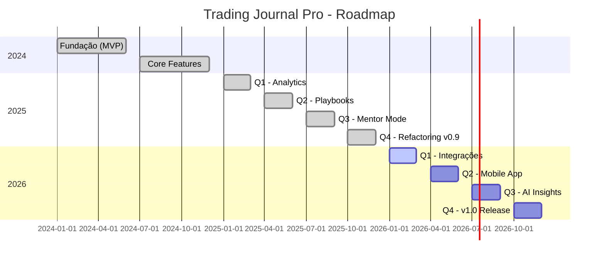

# 🗺️ Roadmap - Trading Journal Pro

> **Objetivo:** Visão da evolução do produto de Q4 2024 a Q4 2026.
> **Última atualização:** 18 de Dezembro de 2025

---

## 🎯 Resumo Executivo (TL;DR)

O projeto está na **fase de consolidação** (v0.9.0). Core features estão completas. Próximo foco: integrações externas (brokers, calendário econômico) e mobile app.

---

## 📅 Timeline Visual

---

## ✅ Concluído (2024-2025)

### Q1-Q2 2024: Fundação

- [x] CRUD de Trades básico
- [x] Autenticação Supabase
- [x] Dashboard inicial
- [x] Sistema de contas múltiplas

### Q3-Q4 2024: Core Features

- [x] Journal Entries com imagens
- [x] Calendário heat map
- [x] Upload de screenshots
- [x] Cálculo de métricas (win rate, PnL)

### Q1-Q2 2025: Premium Features

- [x] Playbooks estruturados
- [x] Multi-timeframe images
- [x] Equity curve chart
- [x] Telemetria de trades

### Q3 2025: Social Features

- [x] Sistema de mentoria (convites)
- [x] Compartilhamento via token
- [x] Comentários de mentor
- [x] Visualização de alunos

### Q4 2025: Refactoring v0.9.0

- [x] Design System completo
- [x] Unificação de componentes
- [x] ~2.000 linhas removidas
- [x] 287 testes passando
- [x] Documentação completa

---

## 🚀 Em Desenvolvimento (Q1 2026)

### 🔴 P0 - Crítico

| Feature              | Status  | Descrição                |
| -------------------- | ------- | ------------------------ |
| Calendário Econômico | 🟢 80%  | Integração Forex Factory |
| Sync Double-Check    | ✅ Done | Segurança nos scrapes    |

### 🟡 P1 - Importante

| Feature             | Status | Descrição                |
| ------------------- | ------ | ------------------------ |
| Import MetaTrader 5 | 🟡 50% | Auto-import de histórico |
| Import TradingView  | ⚪ 0%  | CSV/API integration      |
| Notificações Push   | ⚪ 0%  | Alertas de eventos       |

### 🟢 P2 - Nice-to-have

| Feature            | Status | Descrição          |
| ------------------ | ------ | ------------------ |
| Dark/Light Theme   | ⚪ 0%  | Toggle de tema     |
| Export PDF Reports | ⚪ 0%  | Relatórios mensais |
| Keyboard Shortcuts | ⚪ 0%  | Atalhos de teclado |

---

## 📱 Futuro (Q2-Q4 2026)

### Q2: Mobile App

- [ ] React Native setup
- [ ] Core screens (Dashboard, Trades, Journal)
- [ ] Push notifications
- [ ] Offline mode

### Q3: AI Insights

- [ ] "Você perde mais nas sextas-feiras"
- [ ] Detecção de padrões
- [ ] Sugestões de melhoria
- [ ] Análise de emoções

### Q4: v1.0 Release

- [ ] Onboarding polido
- [ ] Planos de assinatura
- [ ] Landing page marketing
- [ ] Documentação para usuários

---

## 📊 Análise Competitiva

| Feature            | Journal Pro        | Tradervue | Edgewonk      | Tradezilla  |
| ------------------ | ------------------ | --------- | ------------- | ----------- |
| **Preço**          | Free/Premium       | $29-79/mo | €169 one-time | $29/mo      |
| **Journal Visual** | ✅ Superior        | ✅ Bom    | ⚠️ Básico     | ✅ Bom      |
| **Playbooks**      | ✅ Nativo          | ❌ Não    | ⚠️ Básico     | ⚠️ Limitado |
| **Mentoria**       | ✅ Integrado       | ❌ Não    | ❌ Não        | 💲 Extra    |
| **Auto-Import**    | 🟡 Em progresso    | ✅ Sim    | ✅ Sim        | ✅ Sim      |
| **Backtesting**    | ❌ Não             | ❌ Não    | ✅ Sim        | ✅ Sim      |
| **Mobile**         | 🟡 Em planejamento | ❌ Não    | ❌ Não        | ❌ Não      |

### Nossos Diferenciais

1. **Playbooks estruturados** - Nenhum concorrente tem
2. **Sistema de mentoria nativo** - Outros cobram extra
3. **UX moderna** - Design neon premium
4. **Open source friendly** - Documentação extensa

### Gaps a Fechar

1. **Auto-import** - Prioridade Q1 2026
2. **Backtesting** - Estudar viabilidade Q3 2026
3. **Trade Replay** - Avaliar demanda

---

## 🎯 Visão de Longo Prazo

> Ser a **única ferramenta** além da plataforma de execução que o trader precisa abrir.

**Centralizar:**

1. 📝 **Passado** - Diário e análise de trades
2. 📋 **Presente** - Plano de trading e checklists
3. 🔬 **Futuro** - Backtesting e estudo

---

## ❓ FAQ

**P: Por que focar em mentoria antes de mobile?**
R: Mentoria gera retenção e comunidade. Mobile é facilidade de acesso para features já existentes.

**P: Vai ter versão paga?**
R: Sim, modelo freemium planejado para v1.0 (Q4 2026).

**P: Por que não integrar com brokers agora?**
R: APIs de brokers são complexas e instáveis. Preferimos consolidar core primeiro.

---

**Mantido por:** [@TavaresBugs](https://github.com/TavaresBugs)
