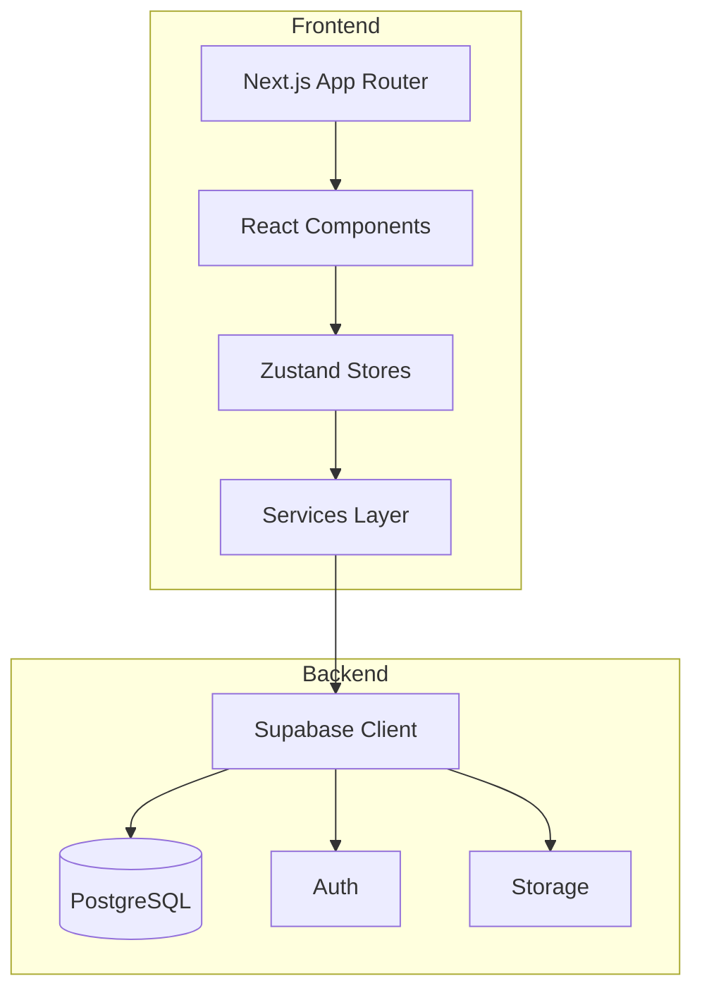
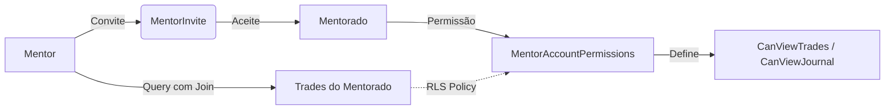
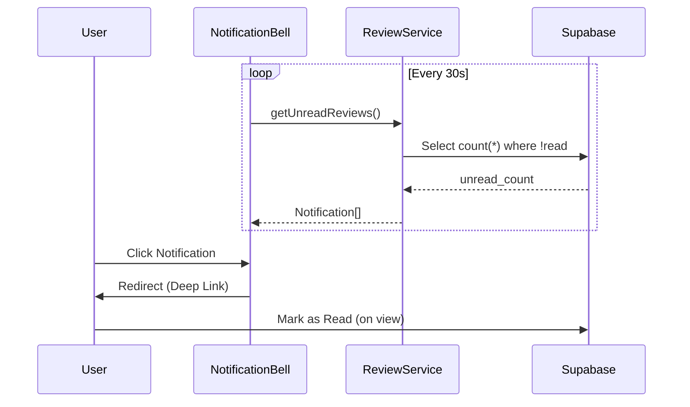

# 🏗️ Arquitetura do Projeto

> Última atualização: Dezembro 2024

## Visão Geral



---

## 📂 Estrutura de Pastas

```
src/
├── app/                    # Next.js App Router
│   ├── admin/              # Painel Admin (protegido)
│   ├── auth/callback/      # OAuth callback
│   ├── dashboard/          # Página principal (protegida)
│   ├── mentor/             # Painel do Mentor (protegido)
│   ├── comunidade/         # Leaderboard e Playbooks
│   ├── login/              # Página de login
│   ├── share/[id]/         # Páginas públicas
│   ├── layout.tsx          # Root layout
│   ├── page.tsx            # Home/Dashboard
│   └── globals.css         # Estilos globais
│
├── components/
│   ├── ui/                 # Componentes base
│   │   ├── Button.tsx
│   │   ├── Card.tsx
│   │   ├── Input.tsx
│   │   ├── Modal.tsx
│   │   ├── Tabs.tsx
│   │   └── Toast.tsx
│   │
│   ├── trades/             # Gestão de trades
│   │   ├── TradeForm.tsx
│   │   ├── TradeList.tsx
│   │   ├── TradeCalendar.tsx
│   │   └── TradeDetails.tsx
│   │
│   ├── journal/            # Journal entries
│   │   ├── JournalEntryModal.tsx
│   │   ├── DayDetailModal.tsx
│   │   └── ...
│   │
│   ├── charts/
│   │   ├── recharts/       # Win Rate, Distribution, Grid
│   │   └── lightweight/    # Equity Curve, Drawdown
│   │
│   ├── playbook/           # Gestão de playbooks
│   ├── accounts/           # Seletor de contas
│   ├── reports/            # Métricas e relatórios
│   └── shared/             # Páginas de compartilhamento
│
├── services/               # Camada de dados
│   ├── accountService.ts   # CRUD contas
│   ├── tradeService.ts     # CRUD trades
│   ├── journalService.ts   # CRUD journal
│   ├── routineService.ts   # Rotinas diárias
│   └── migrationService.ts # Migração de dados
│
├── store/                  # Estado global (Zustand)
│   ├── useAccountStore.ts
│   ├── useTradeStore.ts
│   ├── usePlaybookStore.ts
│   └── ...
│
├── hooks/                  # Custom hooks
│   ├── useAuth.ts
│   ├── useToast.ts
│   └── ...
│
├── lib/                    # Utilitários
│   ├── supabase.ts         # Cliente Supabase
│   ├── storage.ts          # Abstração de storage
│   ├── calculations.ts     # Métricas financeiras
│   └── utils.ts            # Helpers gerais
│
├── types/                  # TypeScript types
│   ├── index.ts
│   └── ...
│
├── contexts/               # React contexts
│   └── AuthContext.tsx
│
├── constants/              # Constantes
│   └── timeframes.ts
│
└── middleware.ts           # Proteção de rotas
```

---

## 🔄 Fluxo de Dados

```
User Action
    ↓
Component (React)
    ↓
Store (Zustand)
    ↓
Service (accountService, tradeService, etc.)
    ↓
Supabase Client
    ↓
PostgreSQL (com RLS)
```

---

## 🗄️ Database Schema

### Tabelas Principais

| Tabela            | Descrição             |
| ----------------- | --------------------- |
| `accounts`        | Carteiras de trading  |
| `trades`          | Operações registradas |
| `journal_entries` | Entradas de journal   |
| `playbooks`       | Estratégias/setups    |
| `daily_routines`  | Checklist diário      |
| `mentor_invites`  | Convites de mentoria  |
| `mentor_reviews`  | Feedbacks de mentor   |
| `users_extended`  | Perfis e roles        |
| `audit_logs`      | Logs de segurança     |

### Row Level Security (RLS)

Todas as tabelas têm políticas RLS que garantem:

- Usuários só acessam seus próprios dados
- Autenticação obrigatória para operações
- **Mentor Mode:** Mentores acessam dados de mentorados apenas se houver permissão explícita na tabela `mentor_account_permissions`.

---

## 👥 Mentor System

O sistema de mentoria permite que usuários experientes analisem o progresso de outros traders.

### Arquitetura de Permissões



### Componentes Chave

| Componente | Função |
|Data Provider|`MentorContext` (Selected Account, Permissions)|
|UI|`StudentCalendarModal`, `MenteeJournalReviewModal`|
|Service|`inviteService`, `reviewService`|

### Fluxo de Review

1. **Mentor** visualiza dia do aluno (`StudentCalendarModal`).
2. **Mentor** cria review (`reviewService.createReview`).
3. **Notificação** é gerada para o aluno.
4. **Aluno** clica na notificação -> Deep link abre o dia correspondente.

---

## 🔔 Sistema de Notificações

Sistema de polling inteligente para atualizações em tempo real (simulado).



- **Tipos de Notificação:** `invite`, `announcement`, `feedback`.
- **Handling:** `NotificationsModal` gerencia a exibição e ações (ex: aceitar convite, ver feedback).

---

## 🛡️ Admin System

Painel administrativo para gestão segura da plataforma.

- **Role-Based Access Control (RBAC):** Roles `admin`, `user`, `guest` definidos em `users_extended`.
- **Audit Logging:** Ações críticas (ban, approve, delete) são logadas em `audit_logs`.
- **Approval Flow:** Novos usuários ficam com status `pending` até aprovação manual.

---

## 🌐 Comunidade & Leaderboard

### Leaderboard Opt-in

O leaderboard é **opt-in**. O usuário deve habilitar explicitamente a exibição de seus dados.

- Tabela: `leaderboard_opt_in`
- View: `leaderboard_entries` (agregação materializada ou view complexa para performance)

### Playbooks Compartilhados

- Tabela: `shared_playbooks`
- Sistema de likes/stars e downloads (clones) de estratégias.

---

## 🎨 Componentes UI

### Design System

| Componente | Variantes                                                            |
| ---------- | -------------------------------------------------------------------- |
| `Button`   | `default`, `outline`, `ghost`, `gradient-primary`, `gradient-danger` |
| `Card`     | `default`, `glass`                                                   |
| `Input`    | `default`, `textarea`                                                |
| `Modal`    | `default`, `fullscreen`                                              |
| `Tabs`     | `default`                                                            |

### Tema

- **Paleta:** Zorin OS (Blue-Grey + Mint)
- **Mode:** Dark only
- **Background:** Blur glassmorphism

---

## 📊 Gráficos

### Recharts (SVG)

- `WinRateChart` - Gauge de win rate
- `WinLossDistributionChart` - Barras de distribuição
- `MonthlyPerformanceGrid` - Heatmap mensal
- `WeekdayWinRateChart` - Performance por dia

### Lightweight Charts (Canvas)

- `EquityCurveLightweight` - Linha de capital
- `DrawdownChartLightweight` - Área de drawdown

---

## 🔐 Autenticação

```
Login Page
    ↓
Supabase Auth (Google OAuth)
    ↓
/auth/callback (troca código por sessão)
    ↓
Middleware verifica sessão
    ↓
Dashboard (protegido)
```

---

## 📦 Dependências Principais

| Pacote                  | Versão  | Uso             |
| ----------------------- | ------- | --------------- |
| `next`                  | 16.0.7  | Framework       |
| `react`                 | 19.2.1  | UI Library      |
| `@supabase/supabase-js` | 2.86.0  | Database        |
| `zustand`               | 5.0.9   | Estado          |
| `recharts`              | 3.5.1   | Gráficos SVG    |
| `lightweight-charts`    | 5.0.9   | Gráficos Canvas |
| `dayjs`                 | 1.11.19 | Datas           |
| `tailwindcss`           | 4.x     | Estilos         |
