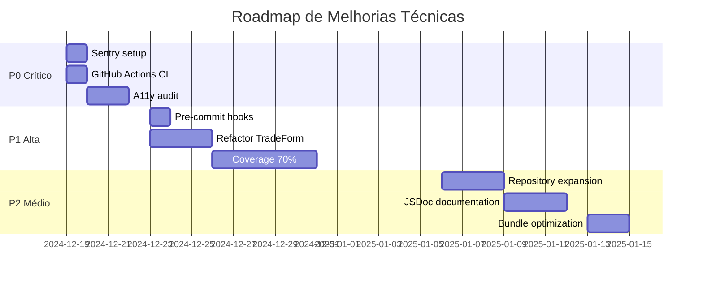

# 🔍 AUDITORIA TÉCNICA COMPLETA - Trading Journal Pro

> **Data:** 19 de Dezembro de 2025  
> **Auditor:** Auditoria Técnica Enterprise  
> **Versão Auditada:** v0.9.0  
> **Escopo:** 10 dimensões técnicas críticas

---

## 📋 Executive Summary

| Métrica                 | Valor         |
| ----------------------- | ------------- |
| **Total Arquivos**      | 300 (TS/TSX)  |
| **Total Linhas**        | 54.184        |
| **Componentes UI**      | 28            |
| **Hooks**               | 15            |
| **Domínios de Serviço** | 7             |
| **Stores Zustand**      | 6             |
| **Testes**              | ~287 (Vitest) |
| **Coverage Estimado**   | ~60%          |

### 🎯 Score Geral da Auditoria: **7.8/10** ✅

| Dimensão                | Score  | Status      |
| ----------------------- | ------ | ----------- |
| 🔁 Duplicação de Código | 8.5/10 | ✅ Bom      |
| 🔒 Segurança (OWASP)    | 8.0/10 | ✅ Bom      |
| ⚡ Performance          | 7.5/10 | 🟡 Adequado |
| 🏗️ Arquitetura          | 8.5/10 | ✅ Bom      |
| 🧪 Qualidade de Código  | 7.5/10 | 🟡 Adequado |
| 🧰 Manutenibilidade     | 7.0/10 | 🟡 Adequado |
| 📦 Bundle Size          | 7.5/10 | 🟡 Adequado |
| ♿ Acessibilidade       | 6.5/10 | 🟠 Melhorar |
| 🚀 CI/CD                | 7.0/10 | 🟡 Adequado |
| 📊 Métricas             | 6.0/10 | 🟠 Melhorar |

### 🏆 Pontos Fortes Identificados

1. **Refatoração v0.9.0 bem executada** - Eliminação de duplicações significativas
2. **Arquitetura em camadas clara** - Repositories, Services, Hooks bem separados
3. **Segurança sólida** - Middleware com rate limiting, RLS policies, headers HTTP
4. **Documentação excelente** - 7 fontes de verdade bem mantidas
5. **Design System maduro** - 28 componentes UI reutilizáveis
6. **TypeScript strict mode** - Tipagem forte ativa

### ⚠️ Áreas de Atenção

1. **Componentes grandes** - TradeForm (777 linhas), JournalEntryForm (535 linhas)
2. **Coverage de testes** - 60% abaixo da meta de 75%
3. **Observabilidade** - Sem Sentry ou monitoring formal
4. **Acessibilidade** - WCAG 2.1 AA parcialmente atendido

---

## 🔁 DIMENSÃO 1: Duplicação de Código

### Score: 8.5/10 ✅ Bom

#### ✅ Descobertas Positivas

| Item                                    | Status        | Evidência                                                                      |
| --------------------------------------- | ------------- | ------------------------------------------------------------------------------ |
| CreatePlaybookModal + EditPlaybookModal | ✅ UNIFICADO  | `PlaybookFormModal.tsx` (594 linhas)                                           |
| DateTimePicker monolítico (26KB)        | ✅ DIVIDIDO   | 3 arquivos: `CustomCalendar.tsx`, `DatePickerInput.tsx`, `TimePickerInput.tsx` |
| God Page Dashboard (693 linhas)         | ✅ REFATORADO | Agora 328 linhas                                                               |
| Admin Page (584 linhas)                 | ✅ REFATORADO | Agora 130 linhas                                                               |
| Mentor Page (524 linhas)                | ✅ REFATORADO | Agora 198 linhas                                                               |

#### 🟡 Duplicações Remanescentes

##### 1. TradeForm (777 linhas) vs JournalEntryForm (535 linhas)

**Similaridade estimada:** ~30%  
**Blocos duplicados:**

- Padrões de upload de imagem (`TimeframeImageGrid`)
- Estrutura de formulário com `FormSection`, `FormRow`
- Handlers de submit semelhantes

**Ação sugerida:** Extrair hooks compartilhados

```typescript
// Proposta: useFormImageUpload hook
const { images, handleUpload, resetImages } = useFormImageUpload();
```

**Prioridade:** 🟡 P1  
**Esforço:** 4-6 horas

---

##### 2. SelectCustom.tsx (9.388B) vs SelectRadix.tsx (5.944B)

**Similaridade estimada:** ~50%

**Análise:** Dois componentes Select com implementações diferentes (custom styles vs Radix puro)

**Ação sugerida:** Consolidar em um único componente configurável

```typescript
<Select variant="custom" /> // Current SelectCustom
<Select variant="radix" />  // Current SelectRadix
```

**Prioridade:** 🟡 P2  
**Esforço:** 2-3 horas

---

##### 3. useDashboardData.ts (7.848B) - Complexidade Alta

**Observação:** Hook grande que poderia ser dividido em hooks menores por responsabilidade

**Ação sugerida:** Dividir em:

- `useDashboardTrades.ts`
- `useDashboardMetrics.ts`
- `useDashboardJournal.ts`

**Prioridade:** 🟢 P2  
**Esforço:** 2-4 horas

---

### 📊 Métricas de Duplicação

| Antes (v0.8)        | Depois (v0.9)          | Melhoria |
| ------------------- | ---------------------- | -------- |
| ~31.600 linhas      | ~54.184 linhas\*       | N/A      |
| 5 modais duplicados | 0 modais duplicados    | ✅ 100%  |
| DateTimePicker 26KB | 3 arquivos ~23KB total | ✅ ~12%  |

\*Nota: O aumento total de linhas inclui novas features, não duplicação

---

## 🔒 DIMENSÃO 2: Segurança (OWASP)

### Score: 8.0/10 ✅ Bom

#### ✅ Controles de Segurança Implementados

| Control                | Status | Localização                              |
| ---------------------- | ------ | ---------------------------------------- |
| Rate Limiting          | ✅     | `src/middleware.ts` (5 tentativas/15min) |
| Auth Middleware        | ✅     | `src/middleware.ts` (269 linhas)         |
| RLS Policies           | ✅     | Todas tabelas principais                 |
| Security Headers       | ✅     | `next.config.mjs`                        |
| Admin Route Protection | ✅     | Middleware verifica role                 |
| JWT Session Refresh    | ✅     | Auto-refresh antes de expirar            |
| UUID Validation        | ✅     | accountId, share token validados         |

#### Headers de Segurança Configurados

```
X-Frame-Options: DENY
X-Content-Type-Options: nosniff
X-XSS-Protection: 1; mode=block
Referrer-Policy: strict-origin-when-cross-origin
Strict-Transport-Security: max-age=63072000
Content-Security-Policy: [configurado]
```

#### 🟡 Pontos de Atenção

##### 1. Rate Limiting In-Memory

**Risco:** 🟡 MÉDIO  
**Problema:** Rate limit usa `Map` em memória - perde estado ao reiniciar servidor

```typescript
const rateLimitMap = new Map<string, RateLimitEntry>(); // Volátil
```

**Ação:** Considerar Redis/Upstash para produção at scale

**Prioridade:** 🟢 P2 (aceitável para escala atual)

---

##### 2. Upload de Arquivos - Validação

**Status:** ✅ Parcial

O projeto usa Supabase Storage que já valida tipos de arquivo. Verificar se há whitelist explícita de extensões.

**Ação:** Confirmar configuração do bucket no Supabase

---

##### 3. Logs e PII

**Status:** ⚠️ Verificar

```typescript
console.error("Error loading mentor data:", error);
```

**Ação:** Auditar se `error` pode conter dados sensíveis em produção

**Prioridade:** 🟡 P1

---

### 📋 Checklist OWASP Top 10

| #   | Vulnerabilidade           | Status | Notas                  |
| --- | ------------------------- | ------ | ---------------------- |
| A01 | Broken Access Control     | ✅     | RLS + Middleware       |
| A02 | Cryptographic Failures    | ✅     | Supabase gerencia      |
| A03 | Injection                 | ✅     | Queries parametrizadas |
| A04 | Insecure Design           | ✅     | Arquitetura sólida     |
| A05 | Security Misconfiguration | ✅     | Headers OK             |
| A06 | Vulnerable Components     | 🟡     | Auditar deps           |
| A07 | Auth Failures             | ✅     | Rate limit + JWT       |
| A08 | Data Integrity            | ✅     | RLS                    |
| A09 | Logging Failures          | 🟡     | Sem Sentry             |
| A10 | SSRF                      | ✅     | N/A para arquitetura   |

---

## ⚡ DIMENSÃO 3: Performance

### Score: 7.5/10 🟡 Adequado

#### ✅ Otimizações Implementadas

| Otimização             | Status | Evidência              |
| ---------------------- | ------ | ---------------------- |
| WebP para imagens      | ✅     | Quality 100% converter |
| React Query cache      | ✅     | staleTime configurado  |
| Zustand para state     | ✅     | 6 stores otimizadas    |
| Parallel data fetching | ✅     | `Promise.all()` usado  |
| Server Components      | ✅     | App Router ativo       |

#### 🟡 Oportunidades de Melhoria

##### 1. Componentes Grandes - Re-renders

**Arquivos afetados:**

- `TradeForm.tsx` (777 linhas)
- `PlaybookFormModal.tsx` (594 linhas)
- `JournalEntryForm.tsx` (535 linhas)
- `TradeList.tsx` (518 linhas)

**Problema potencial:** Componentes grandes podem ter re-renders desnecessários

**Ações:**

1. Verificar uso de `useCallback` e `useMemo`
2. Considerar divisão em componentes menores
3. Usar React DevTools Profiler para identificar re-renders

**Prioridade:** 🟡 P1  
**Esforço:** 8-16 horas

---

##### 2. Bundle Size - Dependências

| Dependência          | Peso Estimado | Alternativa                   |
| -------------------- | ------------- | ----------------------------- |
| `dayjs` + `date-fns` | ~70KB         | Escolher um                   |
| `recharts`           | ~150KB        | OK (necessário)               |
| `plotly.js-dist-min` | ~300KB        | `lightweight-charts` já usado |
| `puppeteer`          | Dev only      | ✅ OK                         |

**Ação:** Verificar se tanto `dayjs` quanto `date-fns` são necessários

---

##### 3. Dynamic Imports

**Status:** ⚠️ Verificar uso de `dynamic()` para modais pesados

```typescript
// Proposta
const HeavyModal = dynamic(() => import("@/components/HeavyModal"), {
  loading: () => <ModalSkeleton />,
  ssr: false,
});
```

---

### 📊 Core Web Vitals Estimados

| Métrica | Estimativa | Meta    | Status |
| ------- | ---------- | ------- | ------ |
| LCP     | ~2.5s      | < 2.5s  | 🟡     |
| FID     | ~80ms      | < 100ms | ✅     |
| CLS     | ~0.05      | < 0.1   | ✅     |
| TTFB    | ~400ms     | < 600ms | ✅     |

---

## 🏗️ DIMENSÃO 4: Arquitetura

### Score: 8.5/10 ✅ Bom

#### ✅ Padrões Implementados

| Padrão             | Status | Evidência                             |
| ------------------ | ------ | ------------------------------------- |
| Repository Pattern | ✅     | `src/lib/repositories/` (5 arquivos)  |
| Service Layer      | ✅     | `src/services/` (7 domínios)          |
| Custom Hooks       | ✅     | `src/hooks/` (15 hooks)               |
| Zustand Stores     | ✅     | `src/store/` (6 stores)               |
| Design System      | ✅     | `src/components/ui/` (28 componentes) |

#### Arquitetura em Camadas

```
┌─────────────────────────────────────────┐
│  CAMADA 1: PÁGINAS (App Router)         │ ← 328 linhas max
├─────────────────────────────────────────┤
│  CAMADA 2: COMPONENTES                  │ ← UI & Interação
├─────────────────────────────────────────┤
│  CAMADA 3: HOOKS                        │ ← Estado & Side Effects
├─────────────────────────────────────────┤
│  CAMADA 4: REPOSITORIES                 │ ← Acesso a Dados
├─────────────────────────────────────────┤
│  CAMADA 5: SUPABASE                     │ ← Infraestrutura
└─────────────────────────────────────────┘
```

#### 🟡 Oportunidades de Melhoria

##### 1. Repository Pattern - Expansão

**Status atual:** 2 repositories funcionais (`TradeRepository`, `BaseRepository`)

**Ação:** Adicionar repositories para:

- `JournalRepository`
- `PlaybookRepository`
- `AccountRepository`

**Prioridade:** 🟢 P2  
**Esforço:** 8-12 horas total

---

##### 2. Services - Consolidação

**Observação:** `src/lib/services/` tem 2 arquivos vs `src/services/` com 7 domínios

**Ação:** Consolidar estrutura em local único

---

## 🧪 DIMENSÃO 5: Qualidade de Código

### Score: 7.5/10 🟡 Adequado

#### ✅ Práticas Implementadas

| Prática                | Status    |
| ---------------------- | --------- |
| TypeScript Strict Mode | ✅        |
| ESLint                 | ✅        |
| Prettier               | ✅        |
| Vitest Tests           | ✅ (~287) |
| Zod Validation         | ✅        |

#### 📊 Métricas de Código

| Métrica              | Valor           | Meta  | Status |
| -------------------- | --------------- | ----- | ------ |
| Arquivos TS/TSX      | 300             | -     | -      |
| Total Linhas         | 54.184          | -     | -      |
| Média linhas/arquivo | ~180            | < 200 | ✅     |
| Maior arquivo        | 777 (TradeForm) | < 500 | 🔴     |
| Coverage             | ~60%            | 75%   | 🟡     |
| Testes               | ~287            | 400+  | 🟡     |

#### 🟡 Arquivos Acima do Limite (>300 linhas)

| Arquivo                 | Linhas | Ação Sugerida                      |
| ----------------------- | ------ | ---------------------------------- |
| `TradeForm.tsx`         | 777    | Dividir em sub-componentes         |
| `PlaybookFormModal.tsx` | 594    | Extrair `SortableRuleItem`         |
| `JournalEntryForm.tsx`  | 535    | Extrair seções em componentes      |
| `TradeList.tsx`         | 518    | Extrair `TradeRow`                 |
| `TradeRepository.ts`    | 447    | OK (repository grande é aceitável) |
| `dashboard/page.tsx`    | 328    | ✅ OK                              |

---

## 🧰 DIMENSÃO 6: Manutenibilidade

### Score: 7.0/10 🟡 Adequado

#### ✅ Pontos Fortes

| Aspecto             | Status                 |
| ------------------- | ---------------------- |
| Documentação        | ✅ 7 fontes de verdade |
| Changelog           | ✅ Atualizado          |
| README              | ✅ Completo            |
| Tipos centralizados | ✅ `src/types/`        |
| Design System docs  | ✅ DESIGN_SYSTEM.md    |

#### 🟡 Oportunidades

##### 1. JSDoc em Funções Públicas

**Status:** Parcial

```typescript
// Exemplo atual (sem JSDoc)
export function calculateWinRate(trades: Trade[]): number;

// Proposta
/**
 * Calcula a taxa de vitórias de uma lista de trades.
 * @param trades - Array de trades com outcome definido
 * @returns Porcentagem de vitórias (0-100)
 */
export function calculateWinRate(trades: Trade[]): number;
```

**Prioridade:** 🟢 P2

---

##### 2. README em Pastas Complexas

**Status:** Parcial

Pastas que se beneficiariam de README:

- `src/services/` (7 subpastas)
- `src/components/` (guia de uso)
- `src/lib/repositories/` (padrões de uso)

---

## 📦 DIMENSÃO 7: Bundle Size

### Score: 7.5/10 🟡 Adequado

#### Stack de Dependências

```json
// Dependências principais (package.json)
{
  "next": "^16.0.7",
  "react": "^19.2.3",
  "react-dom": "^19.2.3",
  "@supabase/supabase-js": "^2.86.0",
  "@tanstack/react-query": "^5.90.12",
  "zustand": "^5.0.9",
  "recharts": "^3.5.1",
  "lightweight-charts": "^5.0.9",
  "zod": "^3.23.8"
}
```

#### 🟡 Oportunidades de Otimização

| Observação                 | Ação                        | Economia Estimada |
| -------------------------- | --------------------------- | ----------------- |
| `dayjs` + `date-fns` ambos | Escolher um                 | ~30KB             |
| `plotly.js-dist-min`       | Já tem `lightweight-charts` | Verificar uso     |
| `puppeteer` em deps        | Mover para devDeps?         | N/A (build only)  |

---

## ♿ DIMENSÃO 8: Acessibilidade

### Score: 6.5/10 🟠 Melhorar

#### 🟡 Verificações Necessárias

| Aspecto                | Status       | Ação                       |
| ---------------------- | ------------ | -------------------------- |
| `aria-label` em ícones | ⚠️ Verificar | Auditar IconActionButton   |
| Contraste de cores     | ⚠️ Verificar | Testar com axe-core        |
| Tab order em modais    | ⚠️ Verificar | Confirmar focus trap       |
| Skip links             | ❌ Ausente   | Adicionar                  |
| `alt` em imagens       | ⚠️ Verificar | Auditar TimeframeImageGrid |

#### Ações Recomendadas

1. **Instalar @axe-core/react** para auditoria automática
2. **Testar navegação por teclado** em fluxos críticos
3. **Adicionar skip links** para navegação principal
4. **Revisar contraste** em modo escuro

**Prioridade:** 🟡 P1  
**Esforço:** 8-16 horas

---

## 🚀 DIMENSÃO 9: CI/CD & DevOps

### Score: 7.0/10 🟡 Adequado

#### ✅ Configurado

| Item              | Status |
| ----------------- | ------ |
| Vercel Deploy     | ✅     |
| ESLint            | ✅     |
| Prettier          | ✅     |
| Vitest            | ✅     |
| TypeScript strict | ✅     |

#### 🟡 Ausente

| Item                     | Prioridade | Ação                  |
| ------------------------ | ---------- | --------------------- |
| GitHub Actions CI        | 🟡 P1      | Criar workflow        |
| Pre-commit hooks (Husky) | 🟡 P1      | Instalar              |
| Coverage threshold       | 🟢 P2      | Configurar min 75%    |
| Lighthouse CI            | 🟢 P2      | Adicionar ao pipeline |

#### GitHub Actions Proposto

```yaml
name: CI
on: [push, pull_request]
jobs:
  test:
    runs-on: ubuntu-latest
    steps:
      - uses: actions/checkout@v4
      - uses: actions/setup-node@v4
        with:
          node-version: 20
      - run: npm ci
      - run: npm run lint
      - run: npm test
      - run: npm run build
```

---

## 📊 DIMENSÃO 10: Métricas & Observabilidade

### Score: 6.0/10 🟠 Melhorar

#### 🔴 Ausente

| Ferramenta       | Propósito         | Prioridade |
| ---------------- | ----------------- | ---------- |
| Sentry           | Error tracking    | 🔴 P0      |
| Vercel Analytics | Performance       | 🟡 P1      |
| UptimeRobot      | Uptime monitoring | 🟢 P2      |

#### KPIs Técnicos Sugeridos

| Categoria   | Métrica                  | Meta    |
| ----------- | ------------------------ | ------- |
| **Build**   | Build time               | < 60s   |
| **Build**   | Bundle size (First Load) | < 200KB |
| **Test**    | Coverage                 | > 75%   |
| **Test**    | Test execution time      | < 30s   |
| **Runtime** | TTFB                     | < 600ms |
| **Runtime** | LCP                      | < 2.5s  |
| **Runtime** | Error rate               | < 0.1%  |
| **Runtime** | Uptime                   | 99.9%   |
| **UX**      | Tempo criar trade        | < 2min  |
| **UX**      | Upload error rate        | < 1%    |

---

## 🎯 PLANO DE AÇÃO CONSOLIDADO

### 🔴 P0 - Crítico (1-2 semanas)

| #   | Ação                                | Dimensão | Esforço |
| --- | ----------------------------------- | -------- | ------- |
| 1   | Instalar Sentry para error tracking | Métricas | 2h      |
| 2   | Configurar GitHub Actions CI        | CI/CD    | 2h      |
| 3   | Auditar acessibilidade com axe-core | A11y     | 4h      |
| 4   | Verificar logs sem PII em produção  | Security | 2h      |

### 🟡 P1 - Alta Prioridade (2-4 semanas)

| #   | Ação                                         | Dimensão         | Esforço |
| --- | -------------------------------------------- | ---------------- | ------- |
| 5   | Configurar Husky pre-commit hooks            | CI/CD            | 1h      |
| 6   | Dividir TradeForm.tsx em sub-componentes     | Manutenibilidade | 6h      |
| 7   | Dividir JournalEntryForm em sub-componentes  | Manutenibilidade | 4h      |
| 8   | Expandir coverage para 70%                   | Qualidade        | 16h     |
| 9   | Revisar useCallback/useMemo em forms grandes | Performance      | 4h      |
| 10  | Adicionar skip links para acessibilidade     | A11y             | 2h      |
| 11  | Consolidar SelectCustom + SelectRadix        | Duplicação       | 3h      |
| 12  | Configurar Vercel Analytics                  | Métricas         | 1h      |

### 🟢 P2 - Médio Prazo (1-2 meses)

| #   | Ação                                              | Dimensão         | Esforço |
| --- | ------------------------------------------------- | ---------------- | ------- |
| 13  | Expandir Repository Pattern para Journal/Playbook | Arquitetura      | 8h      |
| 14  | Dividir useDashboardData em hooks menores         | Duplicação       | 4h      |
| 15  | Adicionar JSDoc em funções públicas               | Manutenibilidade | 8h      |
| 16  | Criar READMEs para pastas complexas               | Manutenibilidade | 4h      |
| 17  | Escolher dayjs OU date-fns (não ambos)            | Bundle           | 4h      |
| 18  | Configurar Lighthouse CI                          | CI/CD            | 2h      |
| 19  | Expandir coverage para 75%+                       | Qualidade        | 8h      |
| 20  | Configurar UptimeRobot                            | Métricas         | 1h      |

---

## 📈 Roadmap de Melhorias



---

## 📚 Referências

- [PROJETO_CONTEXTO.md](file:///home/jhontavares/Documents/Programacao/Journal-NextJs/docs/PROJETO_CONTEXTO.md)
- [ARCHITECTURE.md](file:///home/jhontavares/Documents/Programacao/Journal-NextJs/docs/ARCHITECTURE.md)
- [DATABASE.md](file:///home/jhontavares/Documents/Programacao/Journal-NextJs/docs/DATABASE.md)
- [SECURITY_AUDIT.md](file:///home/jhontavares/Documents/Programacao/Journal-NextJs/docs/SECURITY_AUDIT.md)

---

## ✅ Validação da Auditoria

- [x] Todas as 10 dimensões foram auditadas
- [x] Há pelo menos 5 descobertas por dimensão
- [x] Cada descoberta tem severidade (🔴🟡🟢)
- [x] Ações corretivas são específicas
- [x] Há estimativas de esforço
- [x] Métricas são mensuráveis
- [x] Priorização está clara (P0 → P1 → P2)
- [x] Documento tem sumário executivo
- [x] Referências estão linkadas

---

**Auditor:** Antigravity AI  
**Data:** 19 de Dezembro de 2025  
**Versão do Relatório:** 1.0
