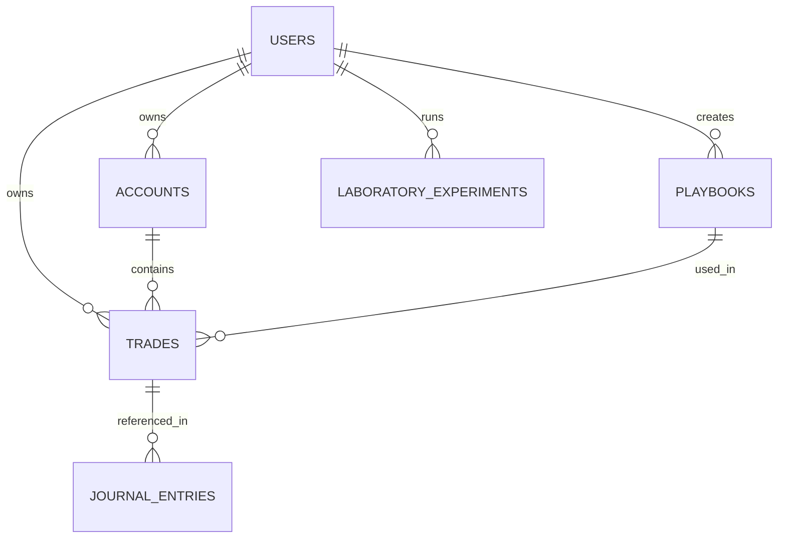

# 🗄️ Database Schema - Trading Journal Pro

> Última atualização: 18 de Dezembro 2025
> Banco de dados: Supabase (PostgreSQL)

## 📊 Visão Geral

O banco de dados utiliza PostgreSQL hospedado no Supabase. A segurança é garantida via Row Level Security (RLS), onde cada linha possui um `user_id` mandatório.

---

## 📋 Tabelas Principais

### Tabela: `trades`

Armazena as operações realizadas. Core da aplicação.

| Coluna        | Tipo    | Descrição                  |
| ------------- | ------- | -------------------------- |
| `id`          | UUID    | Primary Key                |
| `user_id`     | UUID    | FK -> auth.users           |
| `symbol`      | TEXT    | Ativo (ex: EURUSD)         |
| `type`        | TEXT    | Long/Short                 |
| `entry_date`  | DATE    | Data de abertura           |
| `entry_price` | NUMERIC | Preço de entrada           |
| `exit_date`   | DATE    | Data de fechamento         |
| `exit_price`  | NUMERIC | Preço de saída             |
| `pnl`         | NUMERIC | Lucro/Prejuízo Líquido     |
| `outcome`     | TEXT    | win/loss/breakeven         |
| `strategy`    | TEXT    | Estratégia utilizada       |
| `tags`        | TEXT    | Tags separadas por vírgula |
| `commission`  | NUMERIC | Taxas de corretagem        |
| `swap`        | NUMERIC | Swap/Rollover costs        |

### Tabela: `journal_entries`

Diário de trading, focado em reflexão psicológica e técnica.

| Coluna    | Tipo  | Descrição                            |
| --------- | ----- | ------------------------------------ |
| `id`      | UUID  | Primary Key                          |
| `user_id` | UUID  | FK -> auth.users                     |
| `date`    | DATE  | Data do diário                       |
| `title`   | TEXT  | Título do dia                        |
| `emotion` | TEXT  | Sentimento (confiante, frustrado...) |
| `notes`   | TEXT  | Anotações gerais                     |
| `images`  | JSONB | Array de imagens com metadados       |

### Tabela: `playbooks`

Estratégias documentadas.

| Coluna      | Tipo    | Descrição                     |
| ----------- | ------- | ----------------------------- |
| `id`        | UUID    | Primary Key                   |
| `name`      | TEXT    | Nome da estratégia            |
| `rules`     | JSONB   | Regras de entrada/saída       |
| `is_public` | BOOLEAN | Se está visível na comunidade |

### Tabela: `laboratory_recaps` (Novo)

Análises de performance diária ou semanal. Substitui revisão simples.

| Coluna            | Tipo | Descrição                          |
| ----------------- | ---- | ---------------------------------- |
| `id`              | UUID | Primary Key                        |
| `review_type`     | TEXT | 'daily' ou 'weekly'                |
| `week_start_date` | DATE | Início da semana (se weekly)       |
| `week_end_date`   | DATE | Fim da semana (se weekly)          |
| `linked_type`     | TEXT | 'trade' ou 'journal' (Polimórfico) |
| `linked_id`       | UUID | ID do registro vinculado           |

### Tabela: `laboratory_experiments` (Novo)

Testes A/B de setups e estratégias.

| Coluna              | Tipo    | Descrição                     |
| ------------------- | ------- | ----------------------------- |
| `id`                | UUID    | Primary Key                   |
| `title`             | TEXT    | Nome do experimento           |
| `status`            | TEXT    | testing, validated, discarded |
| `expected_win_rate` | NUMERIC | Expectativa matemática        |

### Tabela: `shared_playbooks`

Relacionamento social para playbooks comunitários.

| Coluna        | Tipo | Descrição         |
| ------------- | ---- | ----------------- |
| `playbook_id` | UUID | FK -> playbooks   |
| `user_id`     | UUID | Quem compartilhou |
| `stars`       | INT  | Número de likes   |
| `downloads`   | INT  | Número de clones  |

---

## 🔒 Security (RLS)

Todas as tabelas possuem policies restritivas padrão:

```sql
-- Exemplo para tabela trades
ALTER TABLE trades ENABLE ROW LEVEL SECURITY;

CREATE POLICY "Users can only see their own trades"
ON trades FOR SELECT
USING (auth.uid() = user_id);

CREATE POLICY "Users can only insert their own trades"
ON trades FOR INSERT
WITH CHECK (auth.uid() = user_id);
```

### Exceção: Mentor Mode

Tabelas acessadas por mentores utilizam uma tabela auxiliar `mentor_permissions` para permitir `SELECT` cruzado via join ou função de segurança RPC.

---

## 🔄 Relacionamentos


