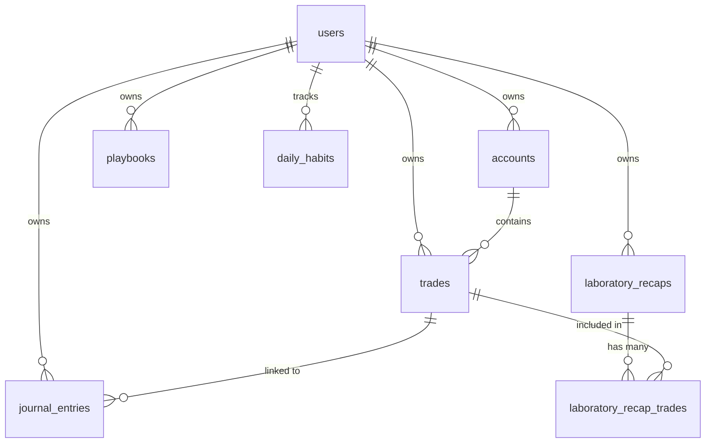

# 🗄️ Database Schema - Trading Journal Pro

> Última atualização: Dezembro 2024
> Banco de dados: Supabase (PostgreSQL)

---

## 📊 Diagrama ER (Simplificado)



---

## 📋 Tabelas Principais

### `trades`

Armazena todas as operações de trading do usuário.

| Coluna        | Tipo         | Nullable | Descrição                                     |
| ------------- | ------------ | -------- | --------------------------------------------- |
| `id`          | UUID         | ❌       | Primary Key                                   |
| `user_id`     | UUID         | ❌       | FK → auth.users                               |
| `account_id`  | UUID         | ❌       | FK → accounts                                 |
| `symbol`      | VARCHAR(50)  | ❌       | Ativo negociado (EURUSD, NQ, etc)             |
| `type`        | VARCHAR(10)  | ❌       | 'Long' ou 'Short'                             |
| `entry_date`  | DATE         | ❌       | Data de entrada                               |
| `entry_time`  | TIME         | ✅       | Hora de entrada (naive, interpretado como NY) |
| `exit_date`   | DATE         | ✅       | Data de saída                                 |
| `exit_time`   | TIME         | ✅       | Hora de saída                                 |
| `lot`         | DECIMAL      | ✅       | Tamanho da posição                            |
| `entry_price` | DECIMAL      | ✅       | Preço de entrada                              |
| `exit_price`  | DECIMAL      | ✅       | Preço de saída                                |
| `stop_loss`   | DECIMAL      | ✅       | Stop Loss                                     |
| `take_profit` | DECIMAL      | ✅       | Take Profit                                   |
| `pnl`         | DECIMAL      | ✅       | Profit/Loss calculado                         |
| `swap`        | DECIMAL      | ✅       | Custo de swap                                 |
| `corretagem`  | DECIMAL      | ✅       | Custos de corretagem                          |
| `strategy`    | VARCHAR(100) | ✅       | Nome da estratégia/playbook                   |
| `setup`       | VARCHAR(100) | ✅       | Setup utilizado                               |
| `outcome`     | VARCHAR(20)  | ✅       | 'win', 'loss', 'breakeven'                    |
| `notes`       | TEXT         | ✅       | Anotações do trade                            |
| `created_at`  | TIMESTAMP    | ❌       | Data de criação                               |
| `updated_at`  | TIMESTAMP    | ❌       | Data de atualização                           |

**Índices:**

- `idx_trades_user_id` (user_id)
- `idx_trades_account_id` (account_id)
- `idx_trades_entry_date` (entry_date)
- `idx_trades_symbol` (symbol)

---

### `laboratory_recaps`

Armazena análises pós-trade e reviews semanais.

| Coluna            | Tipo         | Nullable | Descrição                              |
| ----------------- | ------------ | -------- | -------------------------------------- |
| `id`              | UUID         | ❌       | Primary Key                            |
| `user_id`         | UUID         | ❌       | FK → auth.users                        |
| `trade_id`        | UUID         | ✅       | FK → trades (para review diário)       |
| `title`           | VARCHAR(255) | ❌       | Título do recap                        |
| `review_type`     | VARCHAR(10)  | ❌       | 'daily' ou 'weekly' (default: 'daily') |
| `week_start_date` | DATE         | ✅       | Data início da semana (para weekly)    |
| `week_end_date`   | DATE         | ✅       | Data fim da semana (para weekly)       |
| `what_worked`     | TEXT         | ✅       | O que funcionou                        |
| `what_failed`     | TEXT         | ✅       | O que falhou                           |
| `emotional_state` | VARCHAR(50)  | ✅       | Estado emocional                       |
| `lessons_learned` | TEXT         | ✅       | Lições aprendidas                      |
| `images`          | TEXT[]       | ✅       | Array de URLs de screenshots           |
| `created_at`      | TIMESTAMP    | ❌       | Data de criação                        |
| `updated_at`      | TIMESTAMP    | ❌       | Data de atualização                    |

**Constraints:**

- `check_review_type`: review_type IN ('daily', 'weekly')

**Índices:**

- `idx_recaps_user_id` (user_id)
- `idx_recaps_review_type` (review_type)
- `idx_recaps_week_dates` (week_start_date, week_end_date)

---

### `laboratory_recap_trades`

Tabela de relacionamento many-to-many entre recaps semanais e trades.

| Coluna       | Tipo      | Nullable | Descrição                        |
| ------------ | --------- | -------- | -------------------------------- |
| `id`         | UUID      | ❌       | Primary Key                      |
| `recap_id`   | UUID      | ❌       | FK → laboratory_recaps (CASCADE) |
| `trade_id`   | UUID      | ❌       | FK → trades (CASCADE)            |
| `created_at` | TIMESTAMP | ❌       | Data de criação                  |

**Constraints:**

- UNIQUE(recap_id, trade_id)

**Índices:**

- `idx_recap_trades_recap_id` (recap_id)
- `idx_recap_trades_trade_id` (trade_id)

---

### `daily_habits`

Rastreia hábitos diários vinculados a datas específicas.

| Coluna        | Tipo      | Nullable | Descrição            |
| ------------- | --------- | -------- | -------------------- |
| `id`          | UUID      | ❌       | Primary Key          |
| `user_id`     | UUID      | ❌       | FK → auth.users      |
| `date`        | DATE      | ❌       | Data do registro     |
| `aerobico`    | BOOLEAN   | ❌       | Exercício aeróbico   |
| `alimentacao` | BOOLEAN   | ❌       | Alimentação saudável |
| `leitura`     | BOOLEAN   | ❌       | Leitura/estudo       |
| `meditacao`   | BOOLEAN   | ❌       | Meditação            |
| `premarket`   | BOOLEAN   | ❌       | Rotina pré-mercado   |
| `oracao`      | BOOLEAN   | ❌       | Oração/gratidão      |
| `created_at`  | TIMESTAMP | ❌       | Data de criação      |
| `updated_at`  | TIMESTAMP | ❌       | Data de atualização  |

**Constraints:**

- UNIQUE(user_id, date)

---

### `accounts`

Carteiras de trading do usuário.

| Coluna            | Tipo         | Nullable | Descrição                 |
| ----------------- | ------------ | -------- | ------------------------- |
| `id`              | UUID         | ❌       | Primary Key               |
| `user_id`         | UUID         | ❌       | FK → auth.users           |
| `name`            | VARCHAR(100) | ❌       | Nome da conta             |
| `broker`          | VARCHAR(100) | ✅       | Corretora                 |
| `currency`        | VARCHAR(10)  | ❌       | Moeda (USD, BRL, etc)     |
| `initial_balance` | DECIMAL      | ✅       | Saldo inicial             |
| `current_balance` | DECIMAL      | ✅       | Saldo atual               |
| `leverage`        | INTEGER      | ✅       | Alavancagem               |
| `max_drawdown`    | DECIMAL      | ✅       | Drawdown máximo permitido |
| `created_at`      | TIMESTAMP    | ❌       | Data de criação           |

---

### `journal_entries`

Entradas de journal com screenshots por timeframe.

| Coluna            | Tipo         | Nullable | Descrição                           |
| ----------------- | ------------ | -------- | ----------------------------------- |
| `id`              | UUID         | ❌       | Primary Key                         |
| `user_id`         | UUID         | ❌       | FK → auth.users                     |
| `trade_id`        | UUID         | ✅       | FK → trades                         |
| `date`            | DATE         | ❌       | Data da entrada                     |
| `title`           | VARCHAR(255) | ✅       | Título                              |
| `what_worked`     | TEXT         | ✅       | Acertos                             |
| `what_failed`     | TEXT         | ✅       | Erros                               |
| `improvements`    | TEXT         | ✅       | Melhorias                           |
| `emotional_state` | VARCHAR(50)  | ✅       | Estado emocional                    |
| `screenshots`     | JSONB        | ✅       | Screenshots por timeframe           |
| `share_token`     | VARCHAR(100) | ✅       | Token para compartilhamento público |
| `created_at`      | TIMESTAMP    | ❌       | Data de criação                     |

---

### `playbooks`

Estratégias e setups de trading.

| Coluna        | Tipo         | Nullable | Descrição                                  |
| ------------- | ------------ | -------- | ------------------------------------------ |
| `id`          | UUID         | ❌       | Primary Key                                |
| `user_id`     | UUID         | ❌       | FK → auth.users                            |
| `name`        | VARCHAR(100) | ❌       | Nome da estratégia                         |
| `description` | TEXT         | ✅       | Descrição                                  |
| `icon`        | VARCHAR(10)  | ✅       | Emoji/ícone                                |
| `color`       | VARCHAR(20)  | ✅       | Cor hex                                    |
| `rule_groups` | JSONB        | ✅       | Grupos de regras (mercado, entrada, saída) |
| `is_public`   | BOOLEAN      | ❌       | Compartilhado na comunidade                |
| `created_at`  | TIMESTAMP    | ❌       | Data de criação                            |

---

## 🔒 Row Level Security (RLS)

Todas as tabelas principais têm RLS habilitado com políticas que garantem:

1. **SELECT**: Usuário só pode ver seus próprios registros
2. **INSERT**: Usuário só pode inserir registros com seu próprio `user_id`
3. **UPDATE**: Usuário só pode atualizar seus próprios registros
4. **DELETE**: Usuário só pode deletar seus próprios registros

### Exemplo de Policy

```sql
-- Trades: users can only see their own trades
CREATE POLICY "Users can view own trades" ON trades
  FOR SELECT USING (auth.uid() = user_id);

CREATE POLICY "Users can insert own trades" ON trades
  FOR INSERT WITH CHECK (auth.uid() = user_id);

CREATE POLICY "Users can update own trades" ON trades
  FOR UPDATE USING (auth.uid() = user_id);

CREATE POLICY "Users can delete own trades" ON trades
  FOR DELETE USING (auth.uid() = user_id);
```

### Policies Especiais

**`laboratory_recap_trades`**: Usa subquery para verificar ownership do recap pai:

```sql
CREATE POLICY "Users can view their own recap trades" ON laboratory_recap_trades
  FOR SELECT USING (
    EXISTS (
      SELECT 1 FROM laboratory_recaps
      WHERE laboratory_recaps.id = laboratory_recap_trades.recap_id
      AND laboratory_recaps.user_id = auth.uid()
    )
  );
```

---

## 📂 Migrations

As migrations estão em `supabase/migrations/`:

| Arquivo                                 | Descrição                |
| --------------------------------------- | ------------------------ |
| `001_initial_schema.sql`                | Schema inicial           |
| `002_playbooks.sql`                     | Sistema de playbooks     |
| `003_sharing.sql`                       | Compartilhamento público |
| `004_admin_system.sql`                  | Painel admin e RBAC      |
| `017_add_trade_costs.sql`               | Swap e corretagem        |
| `20241212_add_weekly_recap_support.sql` | Review semanal           |

### Executar Migrations

```bash
# Via Supabase CLI
npx supabase db push

# Ou executar SQL manualmente no Supabase Dashboard
```

---

**Mantido por:** [@TavaresBugs](https://github.com/TavaresBugs)
