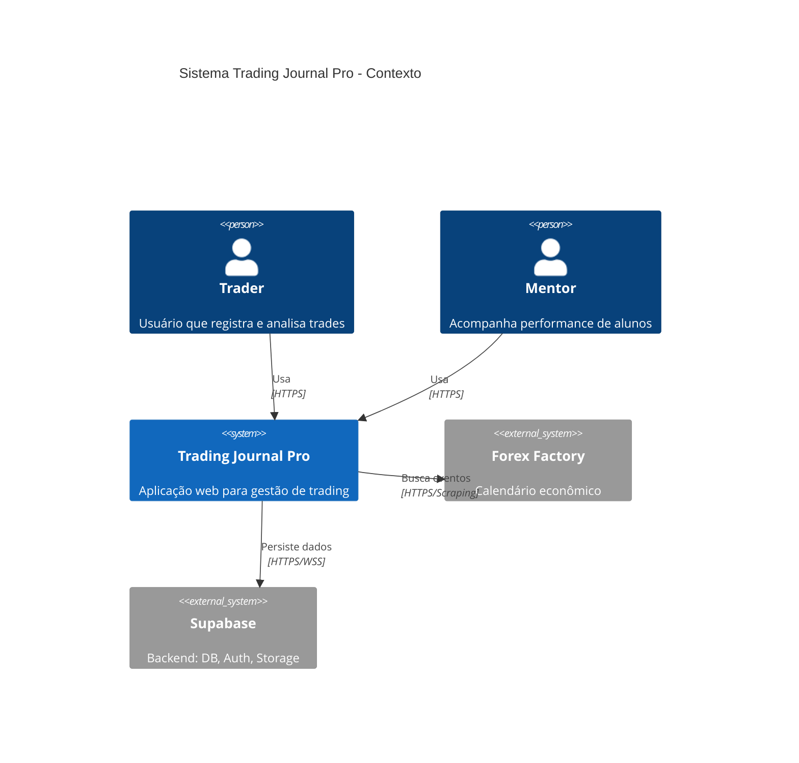
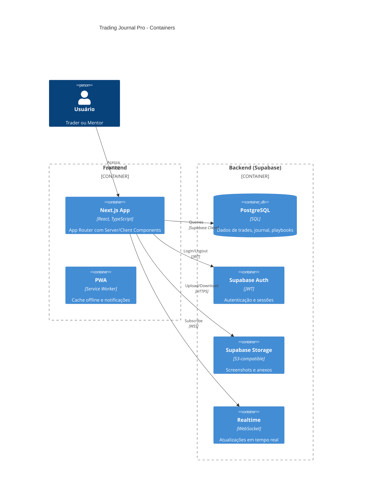
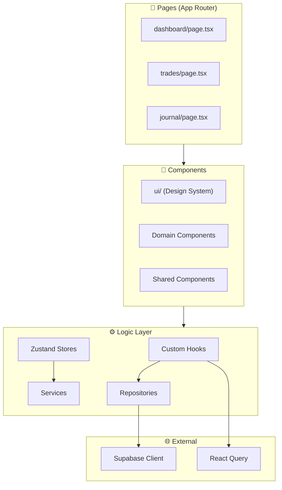
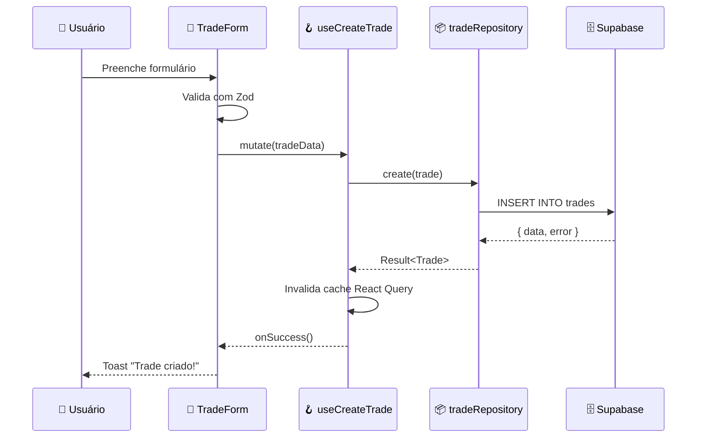

# 🏗️ Arquitetura do Projeto - Trading Journal Pro

> **Objetivo:** Documentar a arquitetura completa com diagramas e explicações didáticas.
> **Público-alvo:** Desenvolvedores iniciantes a avançados
> **Última atualização:** 19 de Dezembro de 2025

---

## 🎯 Resumo Executivo (TL;DR)

O Trading Journal Pro usa arquitetura **Frontend-First com BaaS**, onde Next.js (App Router) é o centro de tudo e Supabase fornece backend completo (DB, Auth, Storage). A segurança é garantida por RLS (Row Level Security) no banco de dados.

### Métricas Atuais

| Métrica          | Valor      |
| ---------------- | ---------- |
| Linhas de código | ~55.000    |
| Arquivos TS/TSX  | ~300       |
| Componentes UI   | 28         |
| Custom Hooks     | 15         |
| Services         | 7 domínios |
| Testes           | 671+       |

---

## 📁 Estrutura de Pastas

```
src/
├── app/                    # 📄 PÁGINAS (Next.js App Router)
│   ├── dashboard/          # Dashboard principal
│   ├── trades/             # Gestão de operações (via dashboard)
│   ├── admin/              # Painel administrativo
│   ├── mentor/             # Sistema de mentoria
│   ├── share/[token]/      # Compartilhamento público
│   ├── api/                # API Routes
│   └── auth/               # Callbacks de autenticação
│
├── components/             # 🧩 COMPONENTES REACT
│   ├── ui/                 # Design System (28 componentes)
│   ├── trades/             # Componentes de trade (24)
│   ├── journal/            # Componentes de journal (17)
│   ├── playbook/           # Componentes de playbook (10)
│   ├── charts/             # Gráficos (13)
│   ├── layout/             # Layout e navegação
│   └── shared/             # Componentes compartilhados
│
├── services/               # ⚙️ LÓGICA DE NEGÓCIO
│   ├── admin/              # Migração, configurações
│   ├── analytics/          # Cálculos e métricas
│   ├── community/          # Playbooks da comunidade
│   ├── core/               # Forex, calendar, utils
│   ├── journal/            # CRUD de journal
│   ├── mentor/             # Sistema de mentoria
│   └── trades/             # CRUD de trades, importação
│
├── hooks/                  # 🪝 CUSTOM HOOKS (15)
│   ├── useAuth.ts          # Autenticação
│   ├── useDashboardData.ts # Dados do dashboard
│   ├── useImageUpload.ts   # Upload de imagens
│   └── ...
│
├── lib/                    # 🔧 UTILITÁRIOS
│   ├── repositories/       # Repository Pattern (acesso a dados)
│   ├── supabase/           # Cliente Supabase
│   ├── utils/              # Helpers e funções utilitárias
│   ├── validation/         # Validação de dados
│   └── logging/            # Sistema de logs
│
├── store/                  # 🗃️ ZUSTAND STORES (6)
├── types/                  # 📐 TYPESCRIPT TYPES
├── schemas/                # ✅ ZOD SCHEMAS
├── providers/              # 🔌 REACT PROVIDERS
├── constants/              # 📋 CONSTANTES
└── __tests__/              # 🧪 TESTES
    ├── components/
    ├── services/
    ├── hooks/
    └── lib/
```

### Regra de Camadas

```
Pages → Components → Hooks → Services → Repositories → Supabase
        (UI)        (State)  (Logic)    (Data)         (Infra)
```

> **Regra:** Cada camada só pode importar da camada abaixo.

---

## 📚 Conceitos Fundamentais

### O que é BaaS (Backend as a Service)?

**Analogia:** Imagine que você quer montar uma loja. BaaS é como alugar um prédio comercial pronto (com segurança, energia, água) em vez de construir do zero.

O Supabase fornece:

- **PostgreSQL:** Banco de dados relacional
- **Auth:** Sistema de login/registro
- **Storage:** Armazenamento de arquivos (imagens)
- **RLS:** Segurança por linha (cada usuário só vê seus dados)

### O que é RLS (Row Level Security)?

**Analogia:** É como um prédio de apartamentos onde cada morador tem uma chave que só abre seu apartamento. Mesmo que todos morem no mesmo prédio, um não entra no apartamento do outro.

```sql
-- Exemplo: Usuário só vê seus próprios trades
CREATE POLICY "Users can only see their trades"
ON trades FOR SELECT
USING (auth.uid() = user_id);
```

---

## 🏛️ Diagrama C4 - Nível 1: Contexto do Sistema



### Explicação

- **Traders** usam o sistema para registrar operações e analisar performance
- **Mentores** acompanham alunos via sistema de convites
- **Supabase** é o backend completo (banco, auth, storage)
- **Forex Factory** fornece calendário econômico via scraping

---

## 🏛️ Diagrama C4 - Nível 2: Containers



### Por que essa arquitetura?

1. **Simplicidade:** Um desenvolvedor consegue manter tudo
2. **Custo:** Supabase tem tier gratuito generoso
3. **Segurança:** RLS é mais seguro que validação no frontend
4. **Performance:** Server Components reduzem JavaScript enviado

---

## 🏛️ Diagrama C4 - Nível 3: Componentes (Frontend)



---

## 🔄 Fluxo de Dados: Criação de um Trade



### Passo a Passo

1. **Usuário** preenche o formulário de trade
2. **TradeForm** valida dados com schema Zod
3. **useCreateTrade** (hook) é chamado com os dados
4. **tradeRepository** executa INSERT no Supabase
5. **Supabase** salva e retorna o trade criado
6. **React Query** invalida cache para atualizar UI
7. **Usuário** vê feedback de sucesso

---

## 📐 Padrões Arquiteturais

### 1. Repository Pattern

**O que é?** Abstração que isola o acesso a dados do resto do código.

**Analogia:** O Repository é como um bibliotecário. Você pede um livro, ele busca e entrega. Você não precisa saber em qual estante está.

```typescript
// src/lib/repositories/tradeRepository.ts
export const tradeRepository = {
  async findByUser(userId: string): Promise<Trade[]> {
    const { data, error } = await supabase
      .from("trades")
      .select("*")
      .eq("user_id", userId)
      .order("entry_date", { ascending: false });

    if (error) throw error;
    return data;
  },

  async create(trade: CreateTradeDTO): Promise<Trade> {
    const { data, error } = await supabase.from("trades").insert(trade).select().single();

    if (error) throw error;
    return data;
  },
};
```

**Benefícios:**

- ✅ Fácil trocar Supabase por outro banco
- ✅ Testes mais simples (mock do repository)
- ✅ Queries centralizadas

---

### 2. Service Layer Pattern

**O que é?** Camada que contém lógica de negócio pura.

**Analogia:** O Service é como um contador. Ele recebe os números (dados) e aplica as regras fiscais (lógica). Não importa de onde os números vieram.

```typescript
// src/services/analytics/taxCalculator.service.ts
export function calculateDayTradeTax(trades: Trade[]): TaxResult {
  // Regra: Day trade = 20% sobre lucro líquido
  const profits = trades.filter((t) => t.outcome === "win").reduce((sum, t) => sum + t.pnl, 0);

  const losses = trades
    .filter((t) => t.outcome === "loss")
    .reduce((sum, t) => sum + Math.abs(t.pnl), 0);

  const netProfit = profits - losses;
  const tax = netProfit > 0 ? netProfit * 0.2 : 0;

  return { profits, losses, netProfit, tax };
}
```

**Benefícios:**

- ✅ Lógica testável isoladamente
- ✅ Reutilizável em diferentes contextos
- ✅ Fácil de entender e manter

---

### 3. Custom Hook Pattern

**O que é?** Hooks React que encapsulam lógica de UI reutilizável.

```typescript
// src/hooks/useTrades.ts
export function useTrades(accountId: string) {
  return useQuery({
    queryKey: ["trades", accountId],
    queryFn: () => tradeRepository.findByAccount(accountId),
    staleTime: 1000 * 60 * 5, // 5 minutos
  });
}

export function useCreateTrade() {
  const queryClient = useQueryClient();

  return useMutation({
    mutationFn: tradeRepository.create,
    onSuccess: () => {
      queryClient.invalidateQueries({ queryKey: ["trades"] });
    },
  });
}
```

---

## 🔗 Dependências Entre Camadas

```
┌─────────────────────────────────────────────────────────────┐
│                         REGRAS                               │
│  • Camada só pode importar da camada ABAIXO                 │
│  • Nunca importe Page em Component                          │
│  • Nunca importe Component em Repository                    │
└─────────────────────────────────────────────────────────────┘

    ┌─────────┐
    │  Pages  │ ← Orquestra componentes
    └────┬────┘
         ↓ pode importar
    ┌─────────────┐
    │  Components │ ← UI e interação
    └──────┬──────┘
           ↓ pode importar
    ┌─────────┐
    │  Hooks  │ ← Estado e side effects
    └────┬────┘
         ↓ pode importar
    ┌──────────────┐
    │ Repositories │ ← Acesso a dados
    └──────┬───────┘
           ↓ pode importar
    ┌──────────┐
    │ Supabase │ ← Infraestrutura
    └──────────┘
```

---

## 🛡️ Decisões Arquiteturais (ADRs)

### ADR-001: Next.js App Router

**Contexto:** Escolher entre Pages Router (legado) ou App Router (moderno).

**Decisão:** App Router.

**Justificativa:**

- Server Components reduzem JavaScript
- Layouts aninhados simplificam código
- É o futuro do Next.js

---

### ADR-002: Supabase como Backend

**Contexto:** Backend customizado (Nest/Express) vs BaaS.

**Decisão:** Supabase (BaaS).

**Justificativa:**

- Velocidade de desenvolvimento (1 dev vs equipe)
- Auth, Storage, Realtime prontos
- RLS é mais seguro que middleware manual

---

### ADR-003: React Query para Server State

**Contexto:** Onde gerenciar dados do servidor?

**Decisão:** React Query para server state, Zustand para client state.

**Justificativa:**

- Cache automático e invalidação
- Loading/error states prontos
- Separação clara de responsabilidades

---

### ADR-004: WebP para Imagens

**Contexto:** Formato de imagem para screenshots.

**Decisão:** Converter todas imagens para WebP (quality 100%).

**Justificativa:**

- 30% menor que PNG/JPEG
- Suportado em todos browsers modernos
- Qualidade visual idêntica

---

## ❓ FAQ - Perguntas Frequentes

**P: Por que não usar Redux?**
R: Zustand + React Query oferece o mesmo com menos boilerplate. Redux é overkill para este projeto.

**P: Por que Repositories se Supabase já tem client?**
R: Abstração. Se mudarmos para Prisma ou outro banco, só alteramos os repositories.

**P: Onde colocar validação?**
R: Em 3 níveis: (1) Frontend com Zod, (2) Tipos TypeScript, (3) Constraints no banco.

**P: Como garantir que RLS está funcionando?**
R: Testes automatizados que tentam acessar dados de outro usuário devem falhar.

---

## 🔗 Referências

- [overview.md](./overview.md) - Visão geral do projeto
- [database.md](./database.md) - Schema e RLS policies
- [design-system.md](./design-system.md) - Componentes UI
- [Next.js App Router](https://nextjs.org/docs/app)
- [Supabase Docs](https://supabase.com/docs)

---

**Mantido por:** [@TavaresBugs](https://github.com/TavaresBugs)
