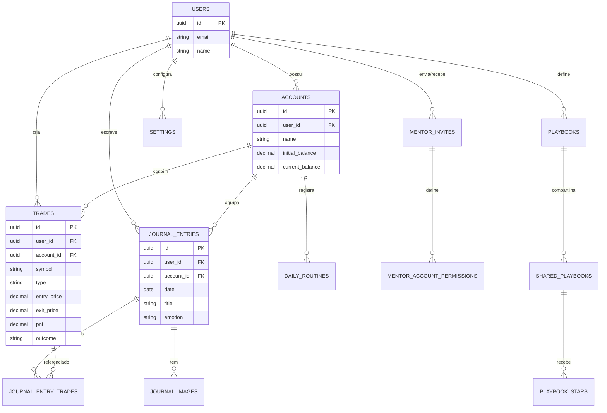

# 🗄️ Database Schema - Trading Journal Pro

> **Objetivo:** Documentar o banco de dados PostgreSQL com ERD, RLS e queries comuns.
> **Público-alvo:** Desenvolvedores
> **Última atualização:** 18 de Dezembro de 2025

---

## 🎯 Resumo Executivo (TL;DR)

O banco usa **PostgreSQL** no Supabase com **19 tabelas** principais. Segurança garantida por **RLS (Row Level Security)** - cada usuário só vê seus próprios dados. O schema suporta multi-conta, mentoria e compartilhamento.

---

## 📚 Conceitos Fundamentais

### O que é RLS (Row Level Security)?

**Analogia:** Imagine um prédio de apartamentos. Cada morador tem uma chave que só abre seu apartamento. RLS faz isso no banco de dados.

```sql
-- Mesmo que todos os trades estejam na mesma tabela,
-- cada usuário só vê os seus:
CREATE POLICY "Users can only see their trades"
ON trades FOR SELECT
USING (auth.uid() = user_id);
```

**Por que é importante?**

- ✅ **Segurança:** Usuário A não vê dados do Usuário B
- ✅ **Simplicidade:** Não precisa filtrar no código
- ✅ **Performance:** Filtro acontece no banco

---

## 🔗 Diagrama ERD (Entity-Relationship)



---

## 📋 Tabelas Principais

### 1. `accounts` - Contas de Trading

Traders podem ter múltiplas contas (real, demo, prop firm).

| Coluna            | Tipo    | Descrição            |
| ----------------- | ------- | -------------------- |
| `id`              | UUID    | PK                   |
| `user_id`         | UUID    | FK → auth.users      |
| `name`            | TEXT    | "Conta Demo", "FTMO" |
| `currency`        | TEXT    | USD, BRL, EUR        |
| `initial_balance` | DECIMAL | Saldo inicial        |
| `current_balance` | DECIMAL | Saldo atualizado     |
| `leverage`        | TEXT    | "1:100", "1:500"     |
| `max_drawdown`    | DECIMAL | Limite de risco (%)  |

---

### 2. `trades` - Operações de Trading

Core da aplicação. Armazena cada trade com detalhes completos.

| Coluna        | Tipo    | Descrição                        |
| ------------- | ------- | -------------------------------- |
| `id`          | UUID    | PK                               |
| `user_id`     | UUID    | FK → auth.users                  |
| `account_id`  | UUID    | FK → accounts                    |
| `symbol`      | TEXT    | EURUSD, XAUUSD, US30             |
| `type`        | TEXT    | Long / Short                     |
| `entry_price` | DECIMAL | Preço de entrada                 |
| `exit_price`  | DECIMAL | Preço de saída                   |
| `lot`         | DECIMAL | Tamanho da posição               |
| `pnl`         | DECIMAL | Lucro/Prejuízo                   |
| `outcome`     | TEXT    | win / loss / breakeven / pending |
| `strategy`    | TEXT    | Nome da estratégia               |
| `session`     | TEXT    | Asia, London, NY                 |
| `htf_aligned` | BOOLEAN | Alinhado com tendência maior?    |
| `r_multiple`  | DECIMAL | Risco/Retorno realizado          |

**Constraints:**

- `type` deve ser `'Long'` ou `'Short'`
- `outcome` deve ser `'win'`, `'loss'`, `'breakeven'`, ou `'pending'`

---

### 3. `journal_entries` - Diário de Trading

Reflexões diárias sobre operações e análises.

| Coluna       | Tipo | Descrição                    |
| ------------ | ---- | ---------------------------- |
| `id`         | UUID | PK                           |
| `user_id`    | UUID | FK → auth.users              |
| `account_id` | UUID | FK → accounts                |
| `date`       | DATE | Data da entrada              |
| `title`      | TEXT | Título descritivo            |
| `asset`      | TEXT | Ativo analisado              |
| `emotion`    | TEXT | confiante, frustrado, neutro |
| `analysis`   | TEXT | Análise técnica              |
| `notes`      | TEXT | Notas gerais                 |

---

### 4. `journal_images` - Imagens Multi-Timeframe

Screenshots de gráficos organizados por timeframe.

| Coluna             | Tipo    | Descrição                |
| ------------------ | ------- | ------------------------ |
| `id`               | UUID    | PK                       |
| `journal_entry_id` | UUID    | FK → journal_entries     |
| `url`              | TEXT    | URL no Supabase Storage  |
| `timeframe`        | TEXT    | M, W, D, H4, H1, M15, M5 |
| `display_order`    | INTEGER | Ordem de exibição        |

---

### 5. `playbooks` - Estratégias Documentadas

Regras de trading em formato estruturado.

| Coluna        | Tipo  | Descrição                    |
| ------------- | ----- | ---------------------------- |
| `id`          | UUID  | PK                           |
| `user_id`     | UUID  | FK → auth.users              |
| `name`        | TEXT  | "Pullback na Tendência"      |
| `description` | TEXT  | Descrição geral              |
| `icon`        | TEXT  | Emoji 📈                     |
| `rule_groups` | JSONB | Array de regras estruturadas |

---

### 6. `mentor_invites` - Sistema de Mentoria

Convites entre mentores e alunos.

| Coluna         | Tipo        | Descrição                     |
| -------------- | ----------- | ----------------------------- |
| `id`           | UUID        | PK                            |
| `mentor_id`    | UUID        | FK → auth.users               |
| `mentee_id`    | UUID        | FK → auth.users (nullable)    |
| `mentee_email` | TEXT        | Email do convidado            |
| `status`       | TEXT        | pending / accepted / rejected |
| `invite_token` | UUID        | Token único para aceitar      |
| `expires_at`   | TIMESTAMPTZ | 7 dias por padrão             |

---

### 7. `economic_events` - Calendário Econômico 🆕

Eventos do Forex Factory.

| Coluna       | Tipo | Descrição           |
| ------------ | ---- | ------------------- |
| `id`         | UUID | PK                  |
| `date`       | DATE | Data do evento      |
| `time`       | TEXT | Horário (ex: 14:30) |
| `currency`   | TEXT | USD, EUR, GBP       |
| `impact`     | TEXT | high / medium / low |
| `event_name` | TEXT | "Non-Farm Payrolls" |
| `actual`     | TEXT | Valor realizado     |
| `forecast`   | TEXT | Expectativa         |
| `previous`   | TEXT | Valor anterior      |

---

## 🔒 RLS Policies

### Padrão Básico (todas tabelas)

```sql
-- Habilita RLS
ALTER TABLE trades ENABLE ROW LEVEL SECURITY;

-- SELECT: Só vê seus dados
CREATE POLICY "select_own" ON trades FOR SELECT
USING (auth.uid() = user_id);

-- INSERT: Só insere para si
CREATE POLICY "insert_own" ON trades FOR INSERT
WITH CHECK (auth.uid() = user_id);

-- UPDATE: Só atualiza seus dados
CREATE POLICY "update_own" ON trades FOR UPDATE
USING (auth.uid() = user_id);

-- DELETE: Só deleta seus dados
CREATE POLICY "delete_own" ON trades FOR DELETE
USING (auth.uid() = user_id);
```

### Exceção: Mentor Access

Mentores podem ver trades de alunos que aceitaram convites:

```sql
CREATE POLICY "mentors_can_view_mentee_trades"
ON trades FOR SELECT
USING (
  auth.uid() = user_id
  OR EXISTS (
    SELECT 1 FROM mentor_invites mi
    WHERE mi.mentor_id = auth.uid()
      AND mi.mentee_id = trades.user_id
      AND mi.status = 'accepted'
  )
);
```

### Exceção: Shared Journals

Links públicos de compartilhamento:

```sql
CREATE POLICY "public_can_view_shared"
ON journal_entries FOR SELECT
USING (
  auth.uid() = user_id
  OR EXISTS (
    SELECT 1 FROM shared_journals sj
    WHERE sj.journal_entry_id = journal_entries.id
      AND sj.expires_at > NOW()
  )
);
```

---

## 📊 Queries Comuns

### 1. Listar trades de uma conta

```sql
SELECT * FROM trades
WHERE account_id = :accountId
ORDER BY entry_date DESC, entry_time DESC
LIMIT 50;
```

### 2. Calcular win rate

```sql
SELECT
  COUNT(*) FILTER (WHERE outcome = 'win') AS wins,
  COUNT(*) FILTER (WHERE outcome = 'loss') AS losses,
  ROUND(
    COUNT(*) FILTER (WHERE outcome = 'win')::numeric /
    NULLIF(COUNT(*), 0) * 100, 2
  ) AS winrate
FROM trades
WHERE account_id = :accountId
  AND outcome IN ('win', 'loss');
```

### 3. PnL por mês

```sql
SELECT
  DATE_TRUNC('month', entry_date) AS month,
  SUM(pnl) AS total_pnl,
  COUNT(*) AS trades
FROM trades
WHERE account_id = :accountId
GROUP BY 1
ORDER BY 1 DESC;
```

### 4. Trades por sessão

```sql
SELECT
  session,
  COUNT(*) AS total,
  SUM(pnl) AS pnl,
  AVG(pnl) AS avg_pnl
FROM trades
WHERE account_id = :accountId
  AND session IS NOT NULL
GROUP BY session
ORDER BY pnl DESC;
```

### 5. Buscar journal com trades vinculados

```sql
SELECT
  je.*,
  COALESCE(
    json_agg(t.*) FILTER (WHERE t.id IS NOT NULL),
    '[]'
  ) AS linked_trades
FROM journal_entries je
LEFT JOIN journal_entry_trades jet ON jet.journal_entry_id = je.id
LEFT JOIN trades t ON t.id = jet.trade_id
WHERE je.account_id = :accountId
GROUP BY je.id
ORDER BY je.date DESC;
```

---

## 📜 Histórico de Migrations

| #   | Arquivo                         | Descrição                   |
| --- | ------------------------------- | --------------------------- |
| 001 | `001_schema.sql`                | Schema inicial (19 tabelas) |
| 002 | `002_functions.sql`             | Functions SQL               |
| 003 | `003_rls_policies.sql`          | Políticas RLS               |
| 004 | `004_fix_anon_access.sql`       | Fix acesso anônimo          |
| 005 | `005_mental_logs.sql`           | Logs mentais                |
| 006 | `006_mental_hub.sql`            | Hub mental                  |
| 012 | `012_laboratory.sql`            | Recaps e experimentos       |
| 019 | `20251218*_economic_events.sql` | Calendário econômico        |

---

## ❓ FAQ

**P: Como testar se RLS está funcionando?**
R: Faça login como usuário A, tente acessar dados do usuário B. Deve retornar vazio.

**P: Posso usar SQL direto no Supabase?**
R: Sim, via SQL Editor no dashboard. Útil para queries complexas.

**P: Como adicionar uma nova coluna?**
R: Crie migration em `supabase/migrations/`, rode `supabase db push`.

---

## 🔗 Referências

- [architecture.md](./architecture.md) - Arquitetura geral
- [Supabase Docs - RLS](https://supabase.com/docs/guides/auth/row-level-security)
- [PostgreSQL Docs](https://www.postgresql.org/docs/)

---

**Mantido por:** [@TavaresBugs](https://github.com/TavaresBugs)
