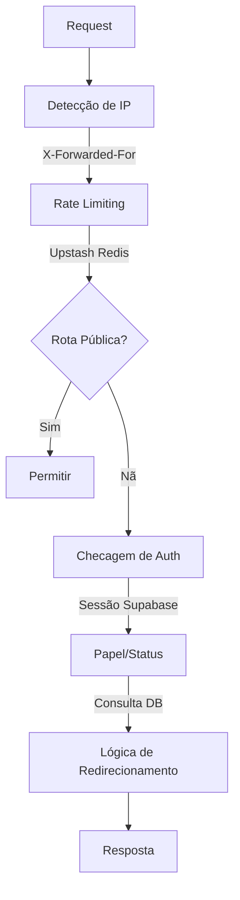

# Arquitetura de Segurança

## Índice

1. [Autenticação e Autorização](#auth)
2. [Segurança do Middleware](#middleware)
3. [Rate Limiting](#rate-limiting)
4. [Headers de Segurança](#headers)
5. [Validação de Entrada](#validation)
6. [Logs de Auditoria](#audit)
7. [Resposta a Incidentes](#incidents)
8. [Testes de Segurança](#security-testing)
9. [Modelo de Ameaças](#threat-model)
10. [Checklist de Segurança](#checklist)

## Autenticação e Autorização {#auth}

### Gerenciamento de Sessão

- **Provedor**: Supabase Auth
- **Tipo de Token**: JWT (cookies httpOnly)
- **Estratégia de Refresh**: Automática (Supabase SDK)
- **Duração da Sessão**: 7 dias (configurável)

### Controle de Acesso Baseado em Papel (RBAC)

| Papel         | Permissões                            | Rotas Permitidas              |
| ------------- | ------------------------------------- | ----------------------------- |
| `user`        | Funcionalidades básicas de trading    | `/dashboard`, `/trades`       |
| `mentor`      | Funcionalidades de usuário + mentoria | `/mentor/*`, rotas de usuário |
| `admin`       | Acesso total ao sistema               | `/admin/*`, todas as rotas    |
| `super_admin` | Admin + operações sensíveis           | `/admin/audit-logs`           |

**Implementação:** Veja `src/config/route-config.ts`

---

## Segurança do Middleware {#middleware}

### Visão Geral da Arquitetura

Request → Detecção de IP → Rate Limit → Checagem de Rota Pública →
Checagem de Auth → Verificação de Papel/Status → Lógica de Redirecionamento → Resposta

### Diagrama de Fluxo do Middleware



### Estrutura de Arquivos

- `src/middleware.ts` - Orquestração principal
- `src/config/route-config.ts` - Permissões de rotas
- `src/lib/auth/middleware-utils.ts` - Funções auxiliares
- `src/lib/ratelimit.ts` - Rate limiting com Redis

### Níveis de Proteção de Rotas

**Rotas Públicas (Sem Auth Necessária):**

- `/login`
- `/termos`
- `/api/public/*`
- `/_next/*` (assets estáticos)

**Rotas Protegidas (Auth Necessária):**

- `/dashboard`
- `/trades/*`
- `/accounts/*`

**Rotas de Admin (Papel de Admin Necessário):**

- `/admin/*`
- `/admin/usuarios`
- `/admin/mentores`

**Rotas de Super Admin:**

- `/admin/audit-logs`

**Implementação:** Veja `ROUTE_PERMISSIONS` em `src/config/route-config.ts`

---

## Rate Limiting {#rate-limiting}

### Estratégia

- **Provedor:** Upstash Redis
- **Algoritmo:** Janela Fixa (Fixed Window Counter)
- **Detecção de IP:** X-Forwarded-For → X-Real-IP → req.ip

### Limites Atuais

| Rota              | Janela | Máx Requisições | Duração do Bloqueio |
| ----------------- | ------ | --------------- | ------------------- |
| `/login`          | 15 min | 5               | 15 min              |
| `/api/trades`     | 1 min  | 100             | 1 min               |
| `/api/*` (padrão) | 1 min  | 200             | 1 min               |

**Configuração:** Veja `src/lib/ratelimit.ts`

### Exceções (Bypasses)

- Requisições autenticadas de IPs conhecidos
- Chamadas de serviço interno (com header secreto)

---

## Headers de Segurança {#headers}

### Headers Configurados (next.config.mjs)

| Header                      | Valor                                 | Propósito                  |
| --------------------------- | ------------------------------------- | -------------------------- |
| `Strict-Transport-Security` | `max-age=31536000; includeSubDomains` | Forçar HTTPS               |
| `X-Content-Type-Options`    | `nosniff`                             | Prevenir MIME sniffing     |
| `X-Frame-Options`           | `DENY`                                | Prevenir clickjacking      |
| `X-XSS-Protection`          | `1; mode=block`                       | Proteção XSS legado        |
| `Referrer-Policy`           | `strict-origin-when-cross-origin`     | Controlar info de referrer |

### Content Security Policy (CSP)

**Gerenciado por:** Sentry SDK (reporte automático de CSP)

```text
default-src 'self';
script-src 'self' 'unsafe-inline' 'unsafe-eval' https://cdn.sentry.io;
style-src 'self' 'unsafe-inline';
img-src 'self' data: https:;
connect-src 'self' https://api.supabase.co https://sentry.io;
```

**Nota:** Ajuste a CSP no `next.config.mjs` ou no dashboard do Sentry.

---

## Validação de Entrada {#validation}

### Validação de UUID (Rotas Dinâmicas)

**Todas as rotas que esperam parâmetros UUID validam o formato antes de consultas ao banco:**

```typescript
// Exemplo: /dashboard/accounts/[id]
if (!isValidUUID(params.id)) notFound();
```

**Regex:** Compatível com RFC 4122 (validação de versão + variante)

**Implementação:** Veja `src/lib/validation/uuid.ts`

### Prevenção de SQL Injection

- **ORM:** Prisma ORM com queries parametrizadas
- **Sem SQL bruto** no código da aplicação (exceto migrações controladas)

### Prevenção de XSS

- Escaping automático do React
- DOMPurify para HTML gerado por usuário (se aplicável)
- Headers CSP

---

## Logs de Auditoria {#audit}

### Eventos Logados

- Autenticação de usuário (login, logout, falhas)
- Ações de admin (criação de usuário, deleção, mudança de papel)
- Negações de acesso a recursos
- Violações de rate limit
- Violações de cabeçalhos de segurança (via relatórios CSP)

### Estrutura do Log

```json
{
  "timestamp": "ISO8601",
  "actorId": "string",
  "actorEmail": "string",
  "actorIp": "string",
  "action": "string",
  "resourceType": "string",
  "resourceId": "string",
  "targetUserId": "string",
  "changes": { "field": "", "oldValue": "", "newValue": "" },
  "result": "success | denied | error"
}
```

---

## Resposta a Incidentes {#incidents}

### Reporte de Problemas de Segurança

**Email:** security@tradelog.com (monitorado 24/7)

**Tempo de Resposta:**

- Crítico: 2 horas
- Alto: 24 horas
- Médio: 7 dias

### Política de Divulgação de Vulnerabilidades

Veja `SECURITY_POLICY.md` para diretrizes de divulgação responsável.

---

## Testes de Segurança {#security-testing}

### Testes Automatizados

**Localização:** `src/__tests__/security/` (ou integrado em testes de middleware/services)

- `middleware-logic.test.ts` - Fluxos de autenticação e redirecionamento
- `uuid.test.ts` - Validação de entrada
- `integration.test.ts` - Controle de acesso e ownership

**Executar:** `npm run test`

### Checklist de Teste Manual

**Autenticação:**

- [ ] Não é possível acessar `/dashboard` sem sessão
- [ ] Sessão expira após logout
- [ ] Rotação de refresh token funciona

**Autorização:**

- [ ] Usuário comum não pode acessar rotas `/admin`
- [ ] Admin não pode acessar `/admin/audit-logs` (apenas super_admin)
- [ ] Usuário suspenso é redirecionado para login

**Rate Limiting:**

- [ ] Login bloqueado após 5 tentativas falhas
- [ ] API retorna 429 após exceder limite
- [ ] Rate limit reseta após janela expirar

**Validação de Entrada:**

- [ ] UUID inválido retorna 404
- [ ] Tentativas de SQL injection bloqueadas
- [ ] Payloads XSS escapados

---

## Modelo de Ameaças {#threat-model}

### Ameaças Identificadas & Mitigações

| Ameaça                                   | Nível de Risco | Mitigação                                       | Status          |
| ---------------------------------------- | -------------- | ----------------------------------------------- | --------------- |
| Quebra de Controle de Acesso (OWASP A01) | Alto           | Validação de UUID + Checagem de Ownership + RLS | ✅ Implementado |
| SQL Injection                            | Alto           | Queries parametrizadas com Prisma ORM           | ✅ Implementado |
| XSS                                      | Médio          | Escaping do React + Headers CSP                 | ✅ Implementado |
| CSRF                                     | Médio          | Cookies SameSite + Tokens Supabase              | ✅ Implementado |
| Força Bruta                              | Médio          | Rate limiting (5 tentativas/15min)              | ✅ Implementado |
| Sequestro de Sessão                      | Baixo          | Cookies httpOnly + Apenas HTTPS                 | ✅ Implementado |
| Clickjacking                             | Baixo          | X-Frame-Options: DENY                           | ✅ Implementado |

### Fora do Escopo (Riscos Aceitos)

- Ataques DDoS (mitigados por Vercel/Cloudflare)
- Segurança física (responsabilidade do provedor de infraestrutura)

---

## Checklist de Segurança {#checklist}

**Antes de Cada Release:**

- [ ] Executar `npm audit` e resolver vulnerabilidades críticas/altas
- [ ] Revisar logs de auditoria por padrões suspeitos
- [ ] Testar tentativas de bypass de autenticação
- [ ] Verificar se rate limits estão sendo aplicados
- [ ] Checar violações de CSP no Sentry
- [ ] Confirmar HTTPS-only em produção
- [ ] Revisar permissões de IAM (Supabase, Upstash)
- [ ] Rotacionar segredos com mais de 90 dias

**Mensalmente:**

- [ ] Revisar e atualizar `docs/security.md`
- [ ] Conduzir auditoria de controle de acesso
- [ ] Testar restauração de backup
- [ ] Revisar dependências de terceiros

---

## Referências

- [OWASP Top 10 2021](https://owasp.org/Top10/)
- [Next.js Security Best Practices](https://nextjs.org/docs/app/building-your-application/configuring/security-headers)
- [Supabase Auth Documentation](https://supabase.com/docs/guides/auth)
- [Upstash Rate Limiting](https://upstash.com/docs/redis/features/ratelimiting)

**Última Atualização:** 24/12/2025
**Revisado Por:** Time de Segurança
**Próxima Revisão:** 24/01/2026
