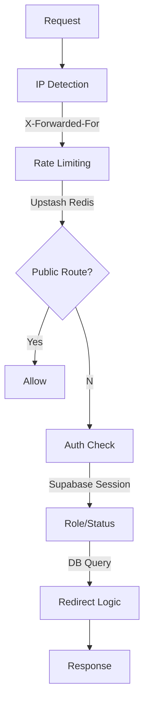

# Security Architecture

## Table of Contents

1. [Authentication & Authorization](#auth)
2. [Middleware Security](#middleware)
3. [Rate Limiting](#rate-limiting)
4. [Security Headers](#headers)
5. [Input Validation](#validation)
6. [Audit Logging](#audit)
7. [Incident Response](#incidents)
8. [Security Checklist](#checklist)
9. [Threat Model](#threat-model)

## Authentication & Authorization {#auth}

### Session Management

- **Provider**: Supabase Auth
- **Token Type**: JWT (httpOnly cookies)
- **Refresh Strategy**: Automatic (Supabase SDK)
- **Session Duration**: 7 days (configurable)

### Role-Based Access Control (RBAC)

| Role          | Permissions               | Routes Allowed           |
| ------------- | ------------------------- | ------------------------ |
| `user`        | Basic trading features    | `/dashboard`, `/trades`  |
| `mentor`      | User features + mentoring | `/mentor/*`, user routes |
| `admin`       | Full system access        | `/admin/*`, all routes   |
| `super_admin` | Admin + sensitive ops     | `/admin/audit-logs`      |

**Implementation:** See `src/config/route-config.ts`

---

## Middleware Security {#middleware}

### Architecture Overview

Request → IP Detection → Rate Limit → Public Route Check →
Auth Check → Role/Status Verification → Redirect Logic → Response

### Middleware Flow Diagram



### Files Structure

- `src/middleware.ts` - Main orchestration
- `src/config/route-config.ts` - Route permissions
- `src/lib/auth/middleware-utils.ts` - Helper functions
- `src/lib/ratelimit.ts` - Redis rate limiting

### Route Protection Levels

**Public Routes (No Auth Required):**

- `/login`
- `/termos`
- `/api/public/*`
- `/_next/*` (static assets)

**Protected Routes (Auth Required):**

- `/dashboard`
- `/trades/*`
- `/accounts/*`

**Admin Routes (Admin Role Required):**

- `/admin/*`
- `/admin/usuarios`
- `/admin/mentores`

**Super Admin Routes:**

- `/admin/audit-logs`

**Implementation:** See `ROUTE_PERMISSIONS` in `src/config/route-config.ts`

---

## Rate Limiting {#rate-limiting}

### Strategy

- **Provider:** Upstash Redis
- **Algorithm:** Fixed Window Counter
- **IP Detection:** X-Forwarded-For → X-Real-IP → req.ip

### Current Limits

| Route              | Window | Max Requests | Block Duration |
| ------------------ | ------ | ------------ | -------------- |
| `/login`           | 15 min | 5            | 15 min         |
| `/api/trades`      | 1 min  | 100          | 1 min          |
| `/api/*` (default) | 1 min  | 200          | 1 min          |

**Configuration:** See `src/lib/ratelimit.ts`

### Bypasses

- Authenticated requests from known IPs
- Internal service calls (with secret header)

---

## Security Headers {#headers}

### Headers Set (next.config.mjs)

| Header                      | Value                                 | Purpose               |
| --------------------------- | ------------------------------------- | --------------------- |
| `Strict-Transport-Security` | `max-age=31536000; includeSubDomains` | Enforce HTTPS         |
| `X-Content-Type-Options`    | `nosniff`                             | Prevent MIME sniffing |
| `X-Frame-Options`           | `DENY`                                | Prevent clickjacking  |
| `X-XSS-Protection`          | `1; mode=block`                       | Legacy XSS protection |
| `Referrer-Policy`           | `strict-origin-when-cross-origin`     | Control referrer info |

### Content Security Policy (CSP)

**Managed by:** Sentry SDK (automatic CSP reporting)

```text
default-src 'self';
script-src 'self' 'unsafe-inline' 'unsafe-eval' https://cdn.sentry.io;
style-src 'self' 'unsafe-inline';
img-src 'self' data: https:;
connect-src 'self' https://api.supabase.co https://sentry.io;
```

**Note:** Adjust CSP in `next.config.mjs` or Sentry dashboard

---

## Input Validation {#validation}

### UUID Validation (Dynamic Routes)

**All routes expecting UUID parameters validate format before database queries:**

```typescript
// Example: /dashboard/accounts/[id]
if (!isValidUUID(params.id)) notFound();
```

**Regex:** RFC 4122 compliant (version + variant validation)

**Implementation:** See `src/lib/validation/uuid.ts`

### SQL Injection Prevention

- **ORM:** Prisma ORM with parameterized queries
- **No raw SQL** in application code (except controlled migrations)

### XSS Prevention

- React automatic escaping
- DOMPurify for user-generated HTML (if applicable)
- CSP headers

---

## Audit Logging {#audit}

### Events Logged

- User authentication (login, logout, failures)
- Admin actions (user creation, deletion, role changes)
- Resource access denials
- Rate limit violations
- Security header violations (via CSP reports)

### Log Structure

```json
{
  "timestamp": "ISO8601",
  "actorId": "string",
  "actorEmail": "string",
  "actorIp": "string",
  "action": "string",
  "resourceType": "string",
  "resourceId": "string",
  "targetUserId": "string",
  "changes": { "field": "", "oldValue": "", "newValue": "" },
  "result": "success | denied | error"
}
```

---

## Incident Response {#incidents}

### Security Issue Reporting

**Email:** security@tradelog.com (monitored 24/7)

**Response Time:**

- Critical: 2 hours
- High: 24 hours
- Medium: 7 days

### Vulnerability Disclosure Policy

See `SECURITY_POLICY.md` for responsible disclosure guidelines.

---

## Threat Model {#threat-model}

### Identified Threats & Mitigations

| Threat                            | Risk Level | Mitigation                               | Status         |
| --------------------------------- | ---------- | ---------------------------------------- | -------------- |
| Broken Access Control (OWASP A01) | High       | UUID validation + ownership checks + RLS | ✅ Implemented |
| SQL Injection                     | High       | Prisma ORM parameterized queries         | ✅ Implemented |
| XSS                               | Medium     | React escaping + CSP headers             | ✅ Implemented |
| CSRF                              | Medium     | SameSite cookies + Supabase tokens       | ✅ Implemented |
| Brute Force                       | Medium     | Rate limiting (5 attempts/15min)         | ✅ Implemented |
| Session Hijacking                 | Low        | httpOnly cookies + HTTPS only            | ✅ Implemented |
| Clickjacking                      | Low        | X-Frame-Options: DENY                    | ✅ Implemented |

### Out of Scope (Accepted Risks)

- DDoS attacks (mitigated by Vercel/Cloudflare)
- Physical security (infrastructure provider responsibility)

---

## Security Checklist {#checklist}

**Before Each Release:**

- [ ] Run `npm audit` and resolve critical/high vulnerabilities
- [ ] Review `audit_logs` for suspicious patterns
- [ ] Test authentication bypass attempts
- [ ] Verify rate limits are enforced
- [ ] Check CSP violations in Sentry
- [ ] Confirm HTTPS-only in production
- [ ] Review IAM permissions (Supabase, Upstash)
- [ ] Rotate secrets older than 90 days

**Monthly:**

- [ ] Review and update `docs/security.md`
- [ ] Conduct access control audit
- [ ] Test backup restoration
- [ ] Review third-party dependencies

---

## References

- [OWASP Top 10 2021](https://owasp.org/Top10/)
- [Next.js Security Best Practices](https://nextjs.org/docs/app/building-your-application/configuring/security-headers)
- [Supabase Auth Documentation](https://supabase.com/docs/guides/auth)
- [Upstash Rate Limiting](https://upstash.com/docs/redis/features/ratelimiting)

**Last Updated:** 2025-12-24
**Reviewed By:** Security Team
**Next Review:** 2026-01-24
